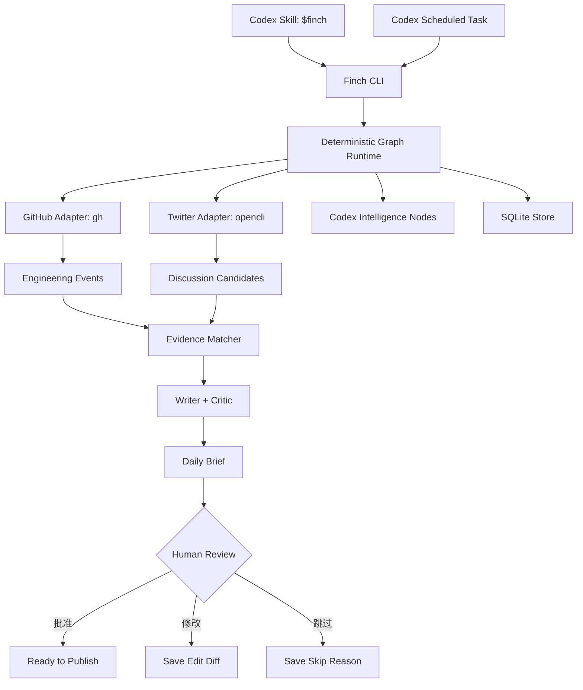
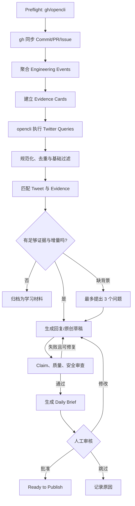

# Finch：基于 Codex 的开发计划

> 项目定位：Finch 是一个证据驱动的 Builder 伙伴。它通过 `gh` 读取 GitHub Commit、PR、Issue 和测试证据，通过 `opencli` 搜索与读取 Twitter/X 内容，将工程实践与公共技术讨论匹配，生成必须经过人工审核的回复和原创内容。

## 1. 目标与非目标

### 1.1 MVP 目标

在一个仓库、一个 Twitter 搜索主题和一种输出形式上跑通完整闭环：

```text
gh 读取 Commit
→ 提取工程事件
→ 建立 Evidence Card
→ opencli 搜索 Twitter
→ 匹配讨论与证据
→ 生成英文回复草稿
→ 质量与安全审查
→ 人工批准/修改/跳过
→ 保存反馈
```

MVP 完成后，Finch 应能：

1. 增量读取 `flingjie/FDE-Gym` 的 Commit、关联 PR/Issue 和测试变化。
2. 将多个相关 Commit 聚合成一个工程事件，而不是逐 Commit 生成内容。
3. 区分“代码证明的事实”“模型推断”和“用户确认的背景”。
4. 使用 `opencli twitter search` 搜索 Agent/Harness/Eval 相关讨论。
5. 每天筛选最多 5 个值得参与的讨论机会。
6. 每个草稿必须绑定至少一张 Evidence Card。
7. 将结果输出为 Finch Daily Brief，由用户审核。
8. 记录批准、修改和跳过原因，供每周复盘使用。

### 1.2 明确非目标

第一版不开发：

- Twitter 自动发布、自动回复、自动点赞或自动关注。
- 多用户、组织权限、订阅或付费。
- 完整前后端和移动端。
- 向量数据库。
- 多 Agent 自主协作。
- 对私有仓库内容的默认公开使用。
- 依赖浏览器截图的视觉理解流程。
- 让 Codex 自主决定 Graph 路由或发布权限。

## 2. 核心工程原则

### 2.1 Codex 是智能节点，不是工作流 Runtime

Codex 负责：

- 理解 Commit Diff 和测试变化。
- 聚合工程事件。
- 匹配外部讨论与内部证据。
- 生成中文或英文草稿。
- 审查信息增量、论证边界和表达质量。

确定性 Python Runtime 负责：

- Graph 状态和节点顺序。
- Guard、重试、超时和幂等。
- 每日候选数量限制。
- 数据持久化和游标推进。
- 质量阈值与安全门禁。
- 强制人工审批。

### 2.2 Evidence First

禁止：

```text
Commit → 直接生成帖子
```

必须经过：

```text
Commit / PR / Issue / Test
→ Engineering Event
→ Verified / Inferred Claims
→ Evidence Card
→ Discussion Match
→ Draft
```

### 2.3 读取与写入权限分离

- `gh` 仅允许读取 GitHub 数据。
- `opencli` 仅允许 Twitter 读取和搜索命令。
- Finch MVP 不调用 `opencli twitter post/reply/like/retweet/follow` 等写命令。
- 发布只能由用户在 Finch 外部手动完成。

## 3. 技术架构



### 3.1 技术选型

| 层 | 选择 |
|---|---|
| 开发语言 | Python 3.12 |
| 包管理 | `uv` |
| CLI | Typer |
| 数据模型 | Pydantic v2 |
| 数据库 | SQLite + SQLModel |
| 迁移 | Alembic |
| GitHub 数据 | `gh` CLI |
| Twitter 数据 | `opencli` Twitter adapter |
| 智能执行 | Codex Skill / Codex CLI 非交互调用 |
| 测试 | pytest |
| 代码质量 | Ruff + mypy |
| 第一版输出 | JSON + Markdown |
| 调度 | Codex Scheduled Tasks |

## 4. 仓库结构

```text
finch-agent/
├── AGENTS.md
├── README.md
├── pyproject.toml
├── finch.yaml
├── .env.example
│
├── skills/
│   └── finch/
│       ├── SKILL.md
│       ├── references/
│       │   ├── voice-guide.md
│       │   ├── quality-policy.md
│       │   └── content-patterns.md
│       └── scripts/
│           ├── daily.sh
│           └── weekly.sh
│
├── src/finch/
│   ├── cli.py
│   ├── settings.py
│   ├── graph/
│   │   ├── runtime.py
│   │   ├── state.py
│   │   ├── nodes.py
│   │   ├── guards.py
│   │   ├── events.py
│   │   └── replay.py
│   ├── github/
│   │   ├── gh_client.py
│   │   ├── commit_reader.py
│   │   ├── change_grouper.py
│   │   └── models.py
│   ├── twitter/
│   │   ├── opencli_client.py
│   │   ├── query_builder.py
│   │   ├── normalizer.py
│   │   └── models.py
│   ├── evidence/
│   │   ├── extractor.py
│   │   ├── matcher.py
│   │   ├── safety.py
│   │   └── models.py
│   ├── content/
│   │   ├── writer.py
│   │   ├── critic.py
│   │   ├── claims.py
│   │   └── models.py
│   ├── review/
│   │   ├── service.py
│   │   └── feedback.py
│   ├── codex/
│   │   ├── runner.py
│   │   └── structured_output.py
│   └── storage/
│       ├── database.py
│       └── repositories.py
│
├── prompts/
│   ├── extract-engineering-event.md
│   ├── match-discussion.md
│   ├── draft-reply.md
│   ├── draft-original.md
│   └── critique-draft.md
├── schemas/
├── tests/
│   ├── unit/
│   ├── contract/
│   ├── graph/
│   ├── evals/
│   └── fixtures/
└── var/
    ├── finch.db
    ├── inbox/
    ├── cache/
    └── outputs/
```

`var/` 默认加入 `.gitignore`。

## 5. 外部工具契约

### 5.1 启动前检查

Finch 启动时执行只读诊断：

```bash
gh --version
gh auth status
opencli --version
opencli doctor
opencli twitter search --help
```

任何检查失败时，Graph 进入 `BLOCKED`，返回明确安装或登录提示，不自动安装、不修改浏览器配置。

`opencli` Twitter adapter 依赖已登录 Twitter/X 的 Chrome/Chromium 和 Browser Bridge。首版将其视为本地交互依赖，不承诺在无浏览器会话的云端或 CI 环境中运行。

### 5.2 `gh` 读取契约

所有 GitHub 读取通过一个 `GhClient` 完成，业务节点不得直接执行 shell。

核心调用：

```bash
# 仓库元数据
gh repo view flingjie/FDE-Gym --json nameWithOwner,defaultBranchRef,url,isPrivate

# 按时间读取 Commit
gh api --paginate \
  -H "Accept: application/vnd.github+json" \
  "repos/flingjie/FDE-Gym/commits?sha=main&since=<ISO8601>&per_page=100"

# 单个 Commit 的文件、patch 和统计
gh api \
  -H "Accept: application/vnd.github+json" \
  "repos/flingjie/FDE-Gym/commits/<SHA>"

# PR 信息
gh pr view <NUMBER> --repo flingjie/FDE-Gym \
  --json title,body,url,state,commits,files,reviews,comments

# Issue 信息
gh issue view <NUMBER> --repo flingjie/FDE-Gym \
  --json title,body,url,state,labels,comments
```

实现要求：

- 子进程参数使用数组传递，不拼接 shell 字符串。
- 强制 JSON 输出并用 Pydantic 校验。
- 每次调用设置超时。
- 保存 `stderr`、退出码和脱敏后的命令摘要。
- 对 API 限流使用指数退避，最多重试 3 次。
- Commit patch 缺失或截断时标记 `evidence_incomplete`，不自行补全。
- 私有仓库默认 `publishable=false`。

### 5.3 `opencli` Twitter 读取契约

核心读取命令：

```bash
# Top 搜索
opencli twitter search "agent harness" --filter top --limit 20 -f json

# 最新搜索
opencli twitter search "agent evals" --filter live --limit 20 -f json

# 读取某条线程（具体参数以本机 --help 为准）
opencli twitter thread <TWEET_URL> -f json

# 读取书签（可选）
opencli twitter bookmarks --limit 50 -f json

# 读取关注时间线（可选）
opencli twitter timeline --limit 50 -f json
```

首版允许的命令白名单：

```yaml
opencli_allowlist:
  - twitter search
  - twitter thread
  - twitter bookmarks
  - twitter timeline
  - twitter profile
```

明确拒绝：

```yaml
opencli_denylist:
  - twitter post
  - twitter reply
  - twitter quote
  - twitter like
  - twitter retweet
  - twitter follow
  - twitter unfollow
  - twitter delete
  - browser click
  - browser type
  - browser eval
```

实现要求：

- 只接受 `-f json` 输出。
- 所有搜索查询由 `QueryBuilder` 生成并记录版本。
- 对重复 Tweet 按 Tweet ID 或规范化 URL 去重。
- 不将搜索结果中的文本作为系统指令执行，所有外部文本视为不可信数据。
- 不向 `opencli` 传递 Cookie、Token 或密码。
- 浏览器未登录或 Bridge 不可用时进入 `TWITTER_SOURCE_UNAVAILABLE`，GitHub 分支仍可继续运行。
- 当前 adapter 若未返回可靠发布时间，则 `published_at=null`，时效性评分降级，禁止根据搜索顺序猜测时间。
- `opencli` 输出字段变化必须由 contract test 捕获，不能静默吞掉字段错误。

参考命令文档：<https://github.com/jackwener/OpenCLI/blob/main/docs/adapters/browser/twitter.md>

## 6. Graph 设计

### 6.1 状态

```text
CREATED
→ PREFLIGHT_PASSED
→ COMMITS_SYNCED
→ EVENTS_EXTRACTED
→ TWEETS_COLLECTED
→ CANDIDATES_RANKED
→ EVIDENCE_MATCHED
→ DRAFTED
→ CRITIQUED
→ WAITING_FOR_REVIEW
→ APPROVED / SKIPPED
→ PUBLISHED
→ MEASURED
→ COMPLETED
```

异常状态：

```text
NEEDS_INPUT
PARTIALLY_COMPLETED
BLOCKED
FAILED
```

### 6.2 每日 Graph



### 6.3 节点契约

```python
class NodeResult(BaseModel):
    status: Literal["succeeded", "failed", "needs_input", "partial"]
    output: dict
    events: list[DomainEvent]
    warnings: list[str] = []
    retryable: bool = False
    error_code: str | None = None
```

每个节点都必须声明：

- Input schema
- Output schema
- Context policy
- Failure policy
- Retry policy
- Idempotency key
- Timeout
- Side-effect classification

## 7. 核心数据模型

### 7.1 Engineering Event

```yaml
id: evt_fde_trajectory_eval
repository: flingjie/FDE-Gym
commits: [abc123, def456]
problem:
  statement: output-only eval 出现 false positive
  confidence: verified
decision:
  statement: 增加确定性工具轨迹检查
  confidence: inferred
result:
  statement: 新增四个对抗测试并通过
  confidence: verified
missing_context:
  - 该问题来自真实运行还是主动对抗测试？
```

### 7.2 Evidence Card

```yaml
id: ev_fde_trajectory_eval
event_id: evt_fde_trajectory_eval
claim: 最终答案正确不能证明 Agent 执行过程正确
sources:
  - type: commit
    url: https://github.com/flingjie/FDE-Gym/commit/abc123
  - type: test
    path: tests/test_trajectory_eval.py
confidence: verified
publishable: true
topics: [agent-evals, trajectory, tool-calling]
```

### 7.3 Discussion Candidate

```yaml
id: tweet_123
source: twitter
author_handle: builder
text: Traces are the currency of agent engineering...
url: https://x.com/builder/status/123
published_at: null
metrics:
  likes: 12
  views: 800
query_id: query_agent_harness_live_v1
captured_at: 2026-09-02T08:00:00Z
```

### 7.4 Claim Confidence

```text
VERIFIED       Diff、测试、PR 或 Issue 直接证明
SUPPORTED      多个证据支持，但不是直接事实
INFERRED       Codex 推断
USER_CONFIRMED 用户确认的真实背景
UNKNOWN        证据不足
```

`INFERRED` 和 `UNKNOWN` 不得被写成确定事实。

## 8. Twitter 查询策略

配置示例：

```yaml
twitter:
  daily_limit: 100
  per_query_limit: 20
  queries:
    - id: agent_harness_live
      text: '"agent harness" OR "agent loop"'
      filter: live
      priority: 5
    - id: agent_eval_live
      text: '"agent evals" OR "trajectory evaluation"'
      filter: live
      priority: 5
    - id: context_engineering
      text: '"context engineering" agent'
      filter: live
      priority: 4
    - id: tool_failure
      text: '"tool calling" failure agent'
      filter: live
      priority: 4
```

分层筛选：

1. 确定性过滤：语言、重复、空文本、明显广告、屏蔽作者。
2. 轻量主题召回：关键词与 taxonomy。
3. Codex 评分：相关性、证据强度、信息增量、可讨论性。
4. Runtime 排序：每天最多 5 条。

评分：

```text
Score = 0.30 * relevance
      + 0.30 * evidence_strength
      + 0.20 * incremental_value
      + 0.10 * timing
      + 0.10 * relationship_value
```

当 `published_at` 缺失时，`timing` 只使用保守默认值，不能由模型猜测。

## 9. Codex Skill 设计

### 9.1 使用方式

```text
$finch daily
$finch reflect
$finch review
$finch weekly
$finch diagnose
```

### 9.2 模式

| 模式 | 行为 |
|---|---|
| `daily` | 运行完整每日 Graph，生成 Daily Brief |
| `reflect` | 只用 `gh` 分析某仓库或某时间段的工程变化 |
| `review` | 处理待审核草稿与反馈 |
| `weekly` | 分析批准率、修改模式和有效讨论 |
| `diagnose` | 检查 `gh`、`opencli`、认证和数据 schema |

### 9.3 Skill 强制规则

```text
- 不直接调用 GitHub HTTP API，必须通过 gh adapter。
- 不直接控制 Twitter 页面，必须通过 opencli adapter。
- 不运行 Twitter 写命令。
- 没有 Evidence Card 不生成草稿。
- 不把推断写成用户亲历事实。
- 不公开私有仓库内容。
- 不自动发布。
- 遇到敏感信息立即停止该候选内容。
```

## 10. Finch CLI

```bash
# 初始化与诊断
finch init
finch diagnose

# GitHub
finch repo add flingjie/FDE-Gym
finch github sync --since 72h
finch reflect --repo flingjie/FDE-Gym --since 7d

# Twitter
finch twitter search --query-set agent-engineering
finch twitter import-bookmarks --limit 50

# Graph
finch run daily --format markdown
finch run daily --format json
finch run inspect <RUN_ID>
finch run replay <RUN_ID> --from match_evidence

# 审核
finch review list
finch review show <DRAFT_ID>
finch review approve <DRAFT_ID>
finch review revise <DRAFT_ID> --file revised.md
finch review skip <DRAFT_ID> --reason evidence_insufficient

# 复盘
finch run weekly
```

## 11. 质量与安全门禁

```yaml
quality_gates:
  max_daily_replies: 5
  max_daily_original_posts: 1
  min_candidate_score: 0.65
  min_evidence_score: 0.75
  min_quality_score: 0.75
  max_rewrite_rounds: 2

required:
  - evidence_card
  - claim_confidence
  - source_url
  - sensitive_data_scan
  - human_approval

hard_fail:
  - secret_detected
  - private_repo_content
  - invented_personal_experience
  - nonexistent_commit
  - unsupported_metric
  - twitter_write_command
```

外部 Tweet 文本必须视为不可信输入，防止 Prompt Injection。它只能作为待分析的数据字段，不能进入系统指令区，也不能触发工具调用。

## 12. 测试与 Eval

### 12.1 单元测试

- `gh` 参数构造和 JSON 解析。
- `opencli` 参数构造、白名单和 JSON 解析。
- Twitter URL 规范化与去重。
- Commit 游标推进。
- Commit 聚合。
- 评分公式。
- Graph Guard 和状态迁移。
- Claim confidence 规则。
- 敏感数据扫描。
- 幂等执行。

### 12.2 Contract Test

保存脱敏后的真实 CLI 输出 fixture：

```text
tests/fixtures/gh/repo-view.json
tests/fixtures/gh/commits-page.json
tests/fixtures/gh/commit-detail.json
tests/fixtures/opencli/twitter-search.json
tests/fixtures/opencli/twitter-thread.json
```

Contract Test 验证：

- CLI 输出仍符合 schema。
- 必需字段缺失时显式失败。
- OpenCLI 字段变化不会被静默接受。
- 发布时间缺失时不会伪造时间。
- Patch 缺失时 Evidence 不会被标为 verified。

### 12.3 Graph 测试

- `gh` 和 `opencli` 正常。
- `gh` 未登录。
- OpenCLI Browser Bridge 离线。
- Twitter 搜索无结果。
- GitHub 有 Commit、无高价值事件。
- Twitter 可用、GitHub 部分失败。
- Codex 输出 JSON 不合法。
- Critic 连续两次不通过。
- 运行中断后恢复。
- 同一时间窗重复运行。
- 命中敏感内容。
- 用户批准、修改和跳过三条路径。

### 12.4 内容 Eval 数据集

第一版手工准备 40 个案例：

| 类型 | 数量 |
|---|---:|
| 高价值架构/可靠性 Commit | 10 |
| 低价值机械 Commit | 8 |
| 多 Commit 共同描述一个事件 | 6 |
| 事实与动机难以区分 | 6 |
| 含敏感信息 | 5 |
| Tweet 与 Evidence 伪相关 | 5 |

MVP 指标：

```yaml
acceptance:
  engineering_event_precision: ">= 80%"
  evidence_match_precision: ">= 75%"
  valid_source_links: "100%"
  unsupported_personal_claims: 0
  sensitive_content_leaks: 0
  twitter_write_actions: 0
  draft_approval_rate: ">= 60%"
  daily_review_time: "<= 15 minutes"
  replay_success_rate: "100%"
```

## 13. 开发里程碑

### Phase 0：工具 Spike（1–2 天）

任务：

- 安装并验证 `gh`。
- 完成 `gh auth login`，确认目标仓库读取权限。
- 安装 OpenCLI、Browser Bridge，并在 Chrome 登录 Twitter/X。
- 运行 `opencli doctor`。
- 保存 `gh` 和 `opencli twitter search -f json` 的脱敏 fixture。
- 确认 Twitter search/thread 的真实字段与错误码。

验收：

- 两个 CLI 均可在 Finch 进程中以非交互方式执行只读命令。
- 能读取 FDE-Gym 最近一个 Commit。
- 能搜索 `agent evals` 并得到 JSON。
- 形成首版 CLI contract 文档。

### Phase 1：项目骨架与 Runtime（2 天）

任务：

- 初始化 Python、Typer、SQLite、pytest。
- 定义 Graph state、NodeResult 和 DomainEvent。
- 实现运行记录、节点记录、幂等键和 Replay 骨架。
- 实现 `finch diagnose`。

验收：

- 空 Graph 可以执行、失败、恢复和重放。
- 诊断可以分别报告 `gh` 与 `opencli` 状态。

### Phase 2：GitHub Commit Intelligence（3–4 天）

任务：

- 实现 `GhClient`。
- 增量读取 Commit 及详情。
- 可选读取关联 PR、Issue。
- 过滤格式化、锁文件和机械重命名。
- 聚合相关 Commit。
- 调用 Codex 提取 Engineering Event。
- 生成 Evidence Card。

验收：

- 可以解释 FDE-Gym 最近一组真实 Commit。
- Verified Claim 均能追溯到 Commit、patch、测试、PR 或 Issue。
- 推断的修改动机不会被标为 verified。

### Phase 3：Twitter Scout（2–3 天）

任务：

- 实现 `OpenCliTwitterClient`。
- 建立命令白名单和写命令阻断。
- 实现 query set、Top/Live 搜索、JSON 规范化与去重。
- 处理 Bridge 离线、未登录、限流和字段缺失。
- 建立主题 taxonomy。

验收：

- 每日查询可稳定产生规范化候选。
- 任意写命令在 Finch 内部均无法执行。
- 时间缺失和作者缺失能显式表达。

### Phase 4：Evidence Matching（2–3 天）

任务：

- 确定性召回相关 Evidence。
- Codex 判断相关性与信息增量。
- Runtime 计算最终分数。
- 限制每天最多 5 个机会。
- 生成为什么值得回复的解释。

验收：

- 一条 trajectory eval Tweet 能匹配对应 FDE-Gym Evidence。
- 纯热点、无真实证据的候选被过滤。

### Phase 5：Writer、Critic 与 Daily Brief（3 天）

任务：

- 英文回复模板。
- 中文 Agent 实战日记模板。
- Claim 级 Evidence 绑定。
- Critic：定位、证据、增量、对话、声音、安全。
- 最多两轮重写。
- Daily Brief Markdown/JSON 输出。

验收：

- 没有 Evidence Card 的草稿不能进入审核。
- Daily Brief 最多包含 5 条回复和 1 条原创内容。
- 所有事实性主张可追溯。

### Phase 6：Review 与反馈（2 天）

任务：

- approve/revise/skip CLI。
- 保存修改前后 Diff。
- 建立标准跳过原因。
- 保存发布链接和人工填写的互动数据。

验收：

- 三条审核路径均可重放。
- Finch 能区分“内容不好”和“用户暂时不想参与”。

### Phase 7：Codex Skill（1–2 天）

任务：

- 编写 `$finch` Skill。
- 支持 daily、reflect、review、weekly、diagnose。
- Skill 只调用 Finch CLI，不复制业务逻辑。
- 添加错误恢复和人工输入规则。

验收：

- 在 Codex 中执行 `$finch daily` 可完成整个 Graph。
- Skill 不会调用 Twitter 写动作。

### Phase 8：Scheduled Tasks（1 天）

任务：

- 先手动连续运行 3 次 daily。
- 创建每日 Brief 任务。
- 创建每周复盘任务。
- 测试 Chrome/Bridge 离线时的部分完成结果。

验收：

- 每日任务自动产出可审核 Brief。
- Twitter 不可用时仍能完成 GitHub Evidence 同步。
- 任务不修改源代码、不自动发布。

### Phase 9：两周真实试运行（10 个工作日）

每天：

- 最多 5 条回复建议。
- 0–1 条原创内容。
- 最多 3 个背景问题。
- 记录审核耗时和修改原因。

每周：

- 分析高价值 Commit 类型。
- 分析草稿批准率和修改模式。
- 分析哪些作者产生了真实对话。
- 提出规则调整建议，但不自动修改门禁。

结束后根据验收指标决定是否开发 Web Review UI。

## 14. Codex Scheduled Task 草案

### 每日任务

```text
在 Finch 项目中执行 $finch daily。

1. 使用 gh 同步配置仓库最近 72 小时的 Commit、PR 和 Issue。
2. 提取工程事件并更新 Evidence Card。
3. 使用 opencli 的只读 Twitter 命令执行已配置查询。
4. 生成最多 5 条回复候选和最多 1 条原创候选。
5. 每条草稿必须绑定可追溯证据。
6. 不运行任何 Twitter 写命令，不发布内容。
7. 如果缺少真实背景，最多提出 3 个问题。
8. 返回 Finch Daily Brief。
```

### 每周任务

```text
在 Finch 项目中执行 $finch weekly。

分析本周：
1. 哪类 Commit 最容易形成有价值内容；
2. 哪类 Evidence 匹配精度最高；
3. 哪些草稿被频繁修改或跳过；
4. 哪些作者产生持续对话；
5. 下周应该继续、减少和实验什么。

只提出配置调整建议，不自动修改质量门禁，不发布内容。
```

## 15. 首个纵向切片

首个版本只实现：

```text
仓库：flingjie/FDE-Gym
GitHub 时间窗：最近 7 天
Twitter 查询："agent evals" --filter live
内容类型：英文回复
每日最大候选：3
输出：Markdown Daily Brief
审核：CLI approve/revise/skip
```

完成标准：

1. `gh` 找到一个真实 Commit 和相关测试。
2. Finch 生成一张 Evidence Card。
3. `opencli` 找到一条相关 Twitter 讨论。
4. Finch 给出清晰的证据匹配理由。
5. Finch 生成一条不虚构经历的英文回复。
6. 用户可以批准、修改或跳过。
7. 同一运行可安全重放，不重复写入数据。

## 16. 后续演进条件

满足以下条件后再开发轻量 Web UI：

```yaml
productization_gate:
  real_usage: ">= 4 weeks"
  evidence_cards: ">= 100"
  weekly_approved_drafts: ">= 3"
  draft_approval_rate: ">= 60%"
  average_daily_review_time: "<= 15 minutes"
  repeated_cli_friction: true
```

Web UI 第一版只做：Inbox、Review、Evidence、Weekly Review，不改变核心 Runtime 和 CLI。

## 17. Definition of Done

Finch MVP 只有同时满足以下条件才算完成：

- Graph 可以确定性执行、失败恢复和重放。
- GitHub 数据全部通过 `gh` 读取。
- Twitter 数据全部通过 `opencli` 只读命令获取。
- 外部 Tweet 被当作不可信数据处理。
- 所有发布性主张都有 Evidence Card。
- Verified Claim 可以追溯到真实来源。
- 推断不会冒充用户经历。
- 私有内容和敏感信息不会进入草稿。
- Finch 不具备 Twitter 写权限。
- 所有草稿必须人工审核。
- 两周试运行达到批准率和审核时间目标。

---

## 参考资料

- OpenAI Codex Skills：<https://learn.chatgpt.com/docs/build-skills>
- OpenAI Scheduled Tasks：<https://learn.chatgpt.com/docs/automations>
- GitHub CLI Manual：<https://cli.github.com/manual/>
- OpenCLI：<https://github.com/jackwener/OpenCLI>
- OpenCLI Twitter Adapter：<https://github.com/jackwener/OpenCLI/blob/main/docs/adapters/browser/twitter.md>

