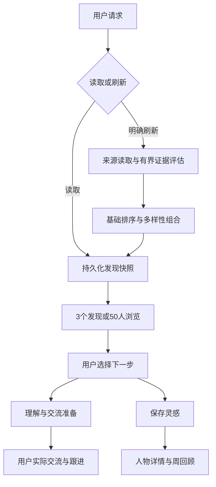

# Finch 跨行业连接与灵感助理：实现计划 v3

日期：2026-09-18  
状态：D1–D10、F1–F2 及旧入口收敛/JSON schema_version 均已实现并提交（见第 12 节勾选）。剩余：P0 元任务、P2 真实使用验收、P3 轻量反馈、P4 四周验证（详见各节标注）。  
依据：用户接受第一轮10题推荐及第二轮实现冲突取舍的全部推荐（1A–10A）。本计划替代 v2；保留第一性原理简化，并按已读取的实现明确改动位置。代码基线为上一轮静态读取的 main 文件，未验证本机 finch.yaml、真实抓取或线上效果；实施时记录实际 HEAD 并核对变化。

## 1. 产品目标与约束

Finch 是以人为核心的跨行业连接与灵感助理：发现不同领域中持续创造、分享一手经验的人，帮助理解其具体实践、自然地开始或延续交流，并保存值得回看的启发。

产品价值来自三件事：接触可信的差异、降低理解与交流成本、保留人与想法的连续性。系统不承诺生成灵感；用户决定是否有启发、是否联系和是否尝试。

两条同等有效的路径：

- 发现人物/作品 → 了解或澄清 → 保存启发 → 按需回看。
- 发现人物/作品 → 准备交流 → 用户亲自互动 → 记录真实对话 → 有新事实时继续。

自由发现默认可用，指定人物/作品/链接和问题探索共用基础服务。无需先提出问题；未知用途的可信发现可以推荐。关系与新视角优先，小尝试与共同实践按需，公开表达为可选出口。

首页至多3个重点发现；真实跟进独立显示。保留50人分层浏览，不凑数，不承诺每天50位新人。建议每日10–15分钟，深入1人、通常不超过3人；这是注意力建议，区别于每次执行的资源硬预算。

五个平台继续在范围内：Twitter/X、GitHub、V2EX、公众号、小红书。已有 Reddit 能力保留；行业开放不等于平台扩张。保留 Skill + Python 领域服务 + 文件 Workspace、统一 CLI、只读来源和人工外发边界。

## 2. 已确认的实现取舍

| 编号 | 已核实实现 | 最终决定 | 动作 |
|---|---|---|---|
| D1 | daily 快照过期/缺失会自动刷新 | 默认读已有结果，明确要求才刷新 | 修改 |
| D2 | 刷新后分析重点连接机会并默认生成碰撞 | 自动做证据与简短理由，选中后深入 | 拆分执行时机 |
| D3 | 连接要求用户经验引用与贡献，否则 SKIP | 允许具体观察＋认真提问；声称亲历才要求个人证据 | 修改门禁 |
| D4 | 证据评估及重点选择有至少两件作品门槛 | 一件充分的一手作品可入重点，标注了解有限 | 统一修改上下游 |
| D5 | 存在六维确定性创作者评分 | 保留基础排序，修正证据数量偏差；首页不突出总分 | 调整并复用 |
| D6 | 四方向轮转、角色关键词及平台新颖性近似多样性 | 具体实践背景和做法优先；平台仅作防垄断上限 | 替换组合规则 |
| D7 | 存在50人展示及新发现/回复/关系三槽位 | 首页3个发现＋独立真实跟进，共用持久化快照 | 统一投影 |
| D8 | CollisionCard 与 MicroExperiment 已实现 | 增加薄灵感笔记；保留碰撞/实验为按需工具 | 保留并退出默认链路 |
| D9 | 来源读取固定 sources.* 查询，GitHub 用登录名 | 显式主题与分平台查询组轮换，AI按需建议调整 | 扩展配置与查询规划 |
| D10 | 生成重点名单即 record_shown，默认7天冷却 | 生成、展示、选择分开；冷却不屏蔽真实跟进 | 修改事件语义 |

另有两项必须修复：

- F1：完整50人推荐没有在非刷新读取路径稳定重放，daily 未刷新时 recommendations 为 None。必须持久化完整结果。
- F2：semantic_assess_limit 未传入每日证据服务；重点连接循环未直接按 deep_prepare_limit 限制。必须接入实际调用边界。

重要纠正：无问题运行、批量证据评估、确定性评分、碰撞卡与实验并非待从零建设。工作重点是修正语义与默认链路，复用已有能力。

## 3. 目标执行结构



现有碰撞分析与实验是用户主动调用的延伸，不在刷新尾部自动运行。正文生成与作者立场确认继续独立按需进行。

## 4. 读取、快照与首页（D1、D7、F1）

### 4.1 命令语义

- connect daily：读取最新可用快照，展示至多3个重点和独立跟进事项；不因过期调用网络或 LLM。
- connect daily --refresh：执行有界刷新，写入成功/部分可用快照后展示。
- connect refresh：刷新而不表示用户已经看过结果；与 --refresh 共用刷新服务。
- connect daily --view browse：拟新增，读同一快照的50人分层列表。
- 快照过期：显示生成时间与过期状态，提示可刷新；不隐藏旧结果。
- 首次无快照：明确提示刷新命令，不隐式抓取。
- 刷新失败：保留旧快照，报告此次失败；区分 refresh_attempted、refresh_succeeded 与使用旧结果，不能用一个布尔值暗示成功。

这里“读取”指不抓取、不推理、不重排；用户实际展示产生的曝光事件属于显式行为记录，见第8节。纯机器读取不自动记曝光。

### 4.2 快照持久化

扩展现有 DiscoverySnapshot 和仓储，不新建平行缓存作为第二真相源。序列化保存：

- schema_version、snapshot_id、生成时间、查询上下文/配置指纹、排序版本；
- priority/summary/browse 的完整有序推荐条目；
- 首页选中的人物/推荐ID、来源引用、简短理由、评估层级、未知项；
- 来源状态、数量缺口与预算/失败摘要；
- 必要的旧字段引用，保持原机会和线程读取路径可用。

现有 dataclass DailyRecommendationSet 需要明确的持久化 DTO 或序列化映射，不能直接假定可以保存。重放不重新评分、不用最新资料覆盖当时推荐理由；人物详情可展示另行更新的资料并注明时间。

由一个服务拥有快照写入职责。核对 daily 服务与 CLI 的双重 upsert/_persist_discovery，避免后一次写入覆盖完整推荐字段。快照原子写成功后才更新 latest 指向。

旧快照缺少推荐列表时保留旧机会内容，并标明“此快照没有完整人物名单，可明确刷新生成”；不得为兼容悄悄联网补齐。

### 4.3 首页与兼容入口

保留5重点/15摘要/30浏览的现有层级作为浏览投影；首页3人从同一合格推荐集合确定并随快照保存，可跨层选取但须满足首页证据要求。无新事实时同一快照反复打开不换人。

people shortlist、connections today 等旧入口代理到统一投影；旧 slot 字段如有机器消费者，提供版本化兼容输出，不再运行独立三槽位排序。真实回复/承诺事项独立从关系领域读取，不占发现槽位，也不受人物冷却限制。

## 5. 推荐、证据与评分（D4、D5、D6）

### 5.1 一件高质量作品可以进入重点

统一检查 evidence_service、shortlist、recommendations、daily metrics 和相关提示中的 >=2 门槛，不能只修改设置。

- 证据服务：有至少一件未评估作品即可在预算内进入评估。
- 重点资格：一件有具体实践细节、可追溯出处、足以支持推荐主张的一手作品即可；一件作品不能证明“持续创造”。
- 只有简介/转发或不充分证据的人可进入待了解浏览层，不能强行升为重点。
- 作品去重用规范 artifact 身份；同篇内容抽取多个证据项不得算成多件作品。
- 未深评者显示信息层级；未知不等于低能力或不愿交流。

CollisionCard 的至少两件证据要求保留在按需深度分析中，不与人物发现门槛混用。只有一件作品时可以阅读、提问或保存灵感，不能为生成碰撞卡伪造第二个来源。

### 5.2 保留确定性评分，修正数量偏差

复用 peers/scoring.py 现有六维 breakdown 和代码总分；首轮保留权重作为基线，不重建评分体系、不向 LLM 索取总分。

- 同一 artifact 的重复同类证据先归一化；计数按不同作品而非证据行数。
- 没有个人交流入口不再直接决定“值得了解”资格；连接准备单独判断。
- 单作品人物可进入重点候选，不将持续性未知视为无实践。
- 对需要重点资格的证据质量，在有界语义判断中给理由和出处；不凭 LLM confidence 数字直接保证事实可靠。
- 基础排序后通过实践差异选择，避免只按数量将全部重点挤满。
- 同分按稳定 person_id 排序，保存 ranking_version；首页呈现具体理由，数值保留在诊断/兼容 JSON。

使用固定样例对照修改前后：同一作品重复抽取不能涨分，充分单作品候选可以入围，多作品但内容重复的人不自动垄断重点。权重调整必须对应实际误排样例。

### 5.3 实践差异优先的平台中立组合

从有依据的 current_work/实践描述及必要的有界语义结果判断做法差异；行业、角色标签只辅助。优先复用现有字段，缺少背景就标未知，不将未知视为“最跨域”。

替换 peer/adjacent/role/serendipity 的固定轮转，以及“新平台等于新领域”的选择条件。具体流程：基础合格筛选 → 评分排序 → 去重 → 尽量覆盖不同实践背景/做法 → 0–1个可信意外发现 → 不足不凑数。

max_per_platform 保留为防垄断上限。min_chinese_platforms_total 不再作为跨域选择依据；代码中核对其是否真被执行，标记弃用或改为诊断。用户明确的语言可读性偏好可独立保留，不能从平台国别推断。

## 6. 来源与主题轮换（D9）

沿用 sources/query_plan.py 和各连接器；增加可编辑主题组到既有配置，不让模型每天无监督地改查询。

建议语义结构（字段名称实施时与现有配置合并）：

```yaml
exploration_topics:
  - id: practical_failure_learning
    label: 不同行业如何从失败中改进
    queries_by_source:
      twitter: ["可由用户维护的查询"]
      v2ex: ["复盘"]
      weixin: ["实践 复盘"]
      xiaohongshu: ["工作 复盘"]
    github_users: []
```

主题不限定行业；查询与种子是可编辑起点。GitHub users 仍是登录名，不把主题词塞进该参数。缺少配置的平台报告未覆盖，不伪造搜索成功。

每次明确刷新选择有界主题组，使用显式轮换记录；同一请求重试复用同一组，纯读取不推进轮换。已有用户固定查询继续有效，查询合并、去重后按分源预算截断。AI 按需提出修改建议，用户接受后才写配置。

指定链接只读取必要上下文；问题模式允许一次性覆盖查询上下文，不能未经确认改变长期兴趣。已有无问题入口保留，不再重复实现一个新的自由探索服务。

## 7. 深入处理与交流门禁（D2、D3、F2）

### 7.1 默认刷新只做发现

run_daily_discovery 不自动循环 assess_connection，不自动调用 CollisionService。默认路径保留来源、证据、基础排序、轻量推荐解释和快照；深度理解、回复准备、碰撞与实验必须由用户选择触发。

generate_collision 的默认值与调用方同时调整；不能只改 CLI 文案。显式 collisions generate 继续可用，不随刷新自动执行。

### 7.2 两种交流方式

复用现有 ConnectionOpportunity、InteractionProposal 和回复路径，补充明确交流类型：

| 类型 | 必要依据 | 合法输出 |
|---|---|---|
| 具体观察＋提问 | 对方作品引用与具体问题 | 指出所见细节，诚实询问做法/取舍 |
| 分享亲历经验 | 上述依据＋用户真实经验引用 | 说明自己的实践，再提出可继续的问题 |

不能再全局以 user_evidence_refs 为空返回 SKIP。只有包含“我用过/我测试过/我们曾经”等亲历主张时，才要求对应个人依据。没有实质观察、问题或贡献时建议阅读/观察，仍可 SKIP 或 DEFER。

修改 connections/service.py 的 build_connection_opportunity、craft_reply，以及 discovery/daily.py 的 assess_connection 的重复限制；同时审查 engagement/proposals.py、prompts/connection-opportunity.md 等旧路径，避免一个入口允许提问、另一个又阻止。

用户选择阅读或澄清时不创建虚假的 InteractionRecord，不把学习请求强制包装成回复草稿。公开发送、记录真实互动与作者立场确认继续分开。

### 7.3 预算真正生效

- daily_people.semantic_assess_limit 传入 CreatorEvidenceService(max_persons=...)，不能只留在配置。
- deep_prepare_limit 限制选中后的深度分析；max_reply_drafts 如保留为批量回复上限，组合执行取适用上限的较小值，并清楚显示生效值。
- 截断/拒绝应在调用前明确返回实际处理范围及未处理ID，不静默部分成功。
- retries 计入总调用/超时预算，批量人物数与模型调用数分开统计；不能以 assessed_persons 当实际 llm_calls。
- 保留批量证据服务，批次失败只降级该批。
- 缓存按作品内容和提示版本更新；已读代码的 pending 判断主要依据 artifact ID，必须核对并补齐内容变化时的失效，不能只相信模块注释。

沿用已有设置的默认数值作为起始资源上限，实际值写入运行摘要；每日建议深入1–3人不是擅自把所有批量硬上限都改成3。

## 8. 展示、选择、冷却（D10）

三个事件独立记录：

1. generated：快照生成，不是曝光，不影响展示冷却。
2. presented：用户界面实际输出给用户的条目，不代表用户认真阅读。
3. selected：用户明确要求查看、深入或准备，不推断为已经交流。

移除 daily 刷新阶段的 record_shown。文本前台只记录实际输出的首页/浏览页；机器 --json 读取默认不记曝光，Codex Skill 真正呈现后使用明确记录入口。失败的前台呈现不得提前记为已展示；终端输出只能作为已呈现代理，不能声称追踪了真实阅读。

使用 snapshot_id＋person_id＋展示面＋展示批次的稳定幂等键或既有等价机制，明确重复打开同一快照不反复延长冷却。同一批次重试不重复计数。50人浏览只记录实际展开输出的人，不将未展开内容都记为已看。

保留7天默认发现冷却和真实新作品例外；仅作用于下一次新发现排序。旧快照可以重看，主动查看人物不被阻止，真实回复与承诺跟进不受影响。

新版本记录 presentation_semantics_version。历史生成即曝光的数据保留供追溯，但不伪装成实际展示；新冷却默认使用新语义事件，允许一次性重新出现旧人物。

## 9. 灵感、碰撞和实验（D8）

新增薄的 Inspiration 笔记领域；独立于真实 ConversationThread 和严格 CollisionCard。沿用 Workspace 与仓储方式，不新增通用知识库。

最小字段：id、text、origin、source_refs、person_ids、可空 conversation_id、创建/修改时间、可空归档时间；可选引用 collision_id。用户自发想法可无来源，不能归因于未发生的对话。

用户明确说“记下来”就保存；系统自行生成的启发建议留在快照或当前讨论中，不建立 proposed/confirmed 审批队列。保存请求幂等，内容相似仅提示，不自动合并不同反思。支持追加笔记、修改正文和归档；追加历史沿用现有机制。

CollisionCard 与 MicroExperiment 保留原模型、历史数据及按需入口。用户可从灵感主动进入深入比较，但必须满足碰撞本身的证据与假设要求；不能为了复用把所有灵感字段强填成可证伪假设。

现有 pick_weekly_collision 用假设文本长度与证据数量挑选，不能称作“最值得验证”。保留工具时改为用户选择；无选择则只展示候选/按时间列出，不新增另一套价值评分。

笔记在人物详情、用户主题检索和周回顾中重现。真实事件可关联笔记；没有新事实不自动建议寒暄。模拟讨论可以保存为 simulation 灵感，永不计入真人关系指标。

## 10. 接口、Skill 与迁移

下列为目标接口，其中新 flags/commands 需实施后才可执行：

```bash
uv run finch connect daily
uv run finch connect daily --refresh
uv run finch connect daily --view browse
uv run finch connect daily --question "其他行业如何处理责任交接？" --refresh
uv run finch connect person <person_id>
uv run finch connect prepare --opportunity <id>
uv run finch inspirations save --text "我想记住的启发" --source <ref>
uv run finch inspirations list
uv run finch inspirations show <id>
uv run finch inspirations note <id> --text "后续补充"
uv run finch inspirations archive <id>
uv run finch collisions generate
uv run finch experiments start <collision_id> --action "..." --observe "..." --stop "..."
uv run finch weekly
```

save 的 --source 可空；修改正文提供既有编辑方式或明确更新参数。曝光记录可扩展已有 presentation 服务/命令，实施时固定唯一入口，不在多个 Skill 各自写文件。

保留 peer-discovery、interaction-preparation、conversation-follow-up、topic-dialogue、idea-discovery、weekly-reflection 等现有 Skill 名称；同步更新触发条件和工具调用。twitter-learning 如存在必须保留。

旧CLI名称可委托新统一服务；新 JSON 增加 schema_version，尽量保留 recommendations 等字段。无意义旧 slot 可在兼容视图保留，不能让它继续支配新首页。对 plan 中新增的“只读 daily”行为，更新 README/帮助文本明确告知；不保留隐式自动刷新作为永久兼容分支。

新字段加法式迁移；旧快照不联网伪补，旧灵感候选不推定为用户认可，旧曝光不伪补。旧碰撞/实验继续可读。回滚恢复旧推荐投影时不能删除新笔记或真实互动。

## 11. 文件级任务映射

| 文件/模块 | 必须修改或核对 |
|---|---|
| src/finch/cli.py | daily读取/刷新、browse首页、旧入口代理、灵感命令、展示记录 |
| src/finch/discovery/daily.py | 移除默认连接/碰撞调用；快照单次完整写入；预算和指标 |
| src/finch/engagement/models.py、storage/repositories.py | 快照DTO、版本、原子写与兼容读取 |
| src/finch/peers/evidence_service.py | 单作品评估、接收配置上限、内容变化缓存失效 |
| src/finch/peers/scoring.py | 按独立作品归一化，保留基础维度，消除重复证据加分 |
| src/finch/peers/recommendations.py、shortlist.py | 实践差异组合、统一首页、单作品资格、稳定排序 |
| src/finch/discovery/candidate_pool.py | 一作品资格与去重一致性，不因未知用途淘汰 |
| src/finch/peers/presentation.py | 生成/展示/选择语义、幂等、冷却版本 |
| src/finch/connections/service.py、engagement/proposals.py | 观察提问与亲历分享分支、证据门禁一致 |
| src/finch/sources/query_plan.py、settings.py | 主题轮换、分源查询、预算单一来源 |
| src/finch/collisions/* | 按需调用与历史兼容，移除文本长度价值代理 |
| 拟新增 src/finch/inspirations/* | 最薄模型/服务/仓储；实际路径按项目惯例 |
| learn/weekly、人物详情 | 灵感回看和独立关系指标 |
| prompts、skills、docs、README、CLAUDE.md、pyproject.toml | 定位、调用边界、数量语义与已实现状态一致 |

不要因本次调整全面重写 CLI、模型或存储。逐项核实两个 Opportunity 领域的引用，避免将 ConnectionOpportunity 的 conn ID 直接交给只识别 engagement Opportunity 的 prepare；统一选中动作的ID解析/明确转换，不靠前缀猜测路由。

## 12. 实施顺序与验收

### P0：基线与具体回归样例

- [ ] 记录HEAD，读取AGENTS.md，核对本表路径和接口。（部分：实施中已读 AGENTS.md 并核对路径，未记录实际 HEAD）
- [x] 将D1–D10、F1–F2映射到实际函数与已有测试。（映射表见下方附录）
- [ ] 准备来源可追溯的语义样例：单作品实践者、陌生领域提问、未知用途、低证据、重复作品、模拟讨论。（未做）
- [ ] 更新产品契约，预定功能明确标待实施。（契约已随实现更新，但“待实施项”未单独标注）

验收：无“已实现能力重新造一遍”的任务，无把现有问题模式误判为必填的改动。

### 附：D1–D10、F1–F2 实现映射（函数 + 测试 + commit）

| 编号 | 语义 | 关键实现（文件 → 函数/字段） | 测试 | commit |
|---|---|---|---|---|
| D1 | 默认只读 daily | `cli.py` → `connect_daily(refresh=False)` / `_snapshot_fresh` / `_load_today_payload` | `test_cli_connect.py`（daily 只读/纯读） | `f67b8a7` |
| D2 | 刷新不自动连接/碰撞 | `discovery/daily.py` → `run_daily_discovery`（移除 assess_connection / CollisionService 自动调用） | `test_discovery_daily.py`、`e2e/test_daily_50_people.py` | `6c85696` |
| D3 | 观察+提问门禁 | `connections/service.py` → `build_connection_opportunity` / `craft_reply`；`discovery/daily.py` → `assess_connection` | `test_connections.py` | `93ad611` |
| D4 | 单作品入重点 | `peers/evidence_service.py` + `peers/shortlist.py` + `peers/recommendations.py` + `settings.min_artifacts_priority=1` | `test_people_shortlist.py::test_single_artifact_is_eligible` | `0be526b` |
| D5 | 去重计分 | `peers/scoring.py`（按 distinct artifact 计数，非证据行） | `test_people_shortlist.py::test_duplicate_artifact_not_double_counted` | `d80b098` |
| D6 | 实践背景多样性 | `peers/recommendations.py` → `select_daily_recommendations`（`_practice_topics` 替换四方向轮转） | `test_daily_people_recommendations.py` | `5ef6e56` |
| D7 | 首页3人 + browse | `peers/recommendations.py` → `select_home_items`；`cli.py` → `connect_daily --view browse`；`engagement/models.py` → `home_person_ids` | `test_daily_people_recommendations.py` | `53bc16b` |
| D8 | 灵感笔记 | `inspirations/{models,service,repository}.py` + `cli.py`（inspirations 命令组） | `test_inspirations.py` | `895827f` |
| D9 | 主题轮换 | `sources/query_plan.py` → `select_exploration_topic`；`settings.py` → `exploration_topics` | `test_source_query_plan.py` | `25487ac` |
| D10 | 三事件分离 | `peers/presentation.py` → `record_shown`/`record_selected`；`cli.py` → `_record_person_presentations`；`engagement/models.py` → `PresentationRecord.presentation_semantics_version` | `test_presentation.py` | `64e9f00` |
| F1 | 完整推荐快照持久化 | `engagement/models.py` → `DiscoverySnapshot.recommendations`；`discovery/daily.py` → `_recommendation_entries`；`cli.py` → `_persist_discovery` | `test_cli_connect.py::test_persist_discovery_preserves_recommendations` | `f67b8a7` |
| F2 | 预算接入 | `discovery/daily.py` → `run_daily_discovery(max_persons=semantic_assess_limit)`；`cli.py` → `connect_prepare(cap=deep_prepare_limit)` | `test_cli_connect.py::test_connect_prepare_caps_at_deep_prepare_limit` | `a2e2a48` |

注：D10 之后另有三个后续提交，属「统一旧入口 + JSON schema_version + 轻量反馈」收敛，非本表 D/F 项：`89b4379`（people shortlist/connections today→关系域）、`1469e05`（connect today→daily 别名）、`2b23ee9`（移除 legacy shortlist 字段 + schema_version）、`960df6d`（轻量反馈 no_time_today）。

### P1：优先修复执行边界与快照

- [x] F1完整推荐快照及单一写入路径。
- [x] D1默认只读、过期提示与失败回退。
- [x] D2默认刷新移除连接分析/碰撞。
- [x] F2预算接入，调用数与人数正确统计。
- [x] D10生成与曝光分离，JSON读取无曝光副作用。

验收：刷新一次后重启进程，不联网即可读到相同50人有序结果；修改人数/调用上限实际生效；刷新本身不造成冷却；失败不覆盖可用旧结果。

### P2：交付完整最小价值闭环

- [x] D4单作品证据评估与重点资格端到端一致。
- [x] D3选中后支持观察提问，亲历断言仍要求证据。
- [x] D7首页3人及独立跟进，与浏览同快照。
- [x] D8薄灵感保存、人物回看、周回顾；保留按需碰撞与实验。
- [ ] 更新对应Skill并进行5次真实使用，覆盖三个入口。（待用户真实使用验收，不可用模拟反馈替代）

验收：发现一件可信作品→用户选择了解或提问→保存一条灵感→再次找到；不要求已有个人经验或实验计划。无真实使用条件时明确记录待用户验收，不能用模拟反馈代替。

### P3：优化发现质量与配置

- [x] D5修正重复证据计分，保留基础分；回归单作品入围与评分解释。
- [x] D6实践背景差异替换四方向/平台新颖性组合。
- [x] D9显式主题查询组轮换，保留固定查询与GitHub登录名语义。
- [ ] 加入轻量反馈，不将“今天没时间”映射成长期排斥。（未实施）
- [x] 统一旧入口与JSON兼容视图，核对所有文档。（connect today→daily 别名；people shortlist/connections today→关系域承诺投影；JSON 加 schema_version=2、移除旧 shortlist 字段）

验收：不同平台同一种做法不被自动认定为跨域；非技术可信人物可进入重点；纯读和请求重试不推进主题轮换。

### P4：四周验证后再扩展

（未开始：需 P2 真实使用完成后按周推进。）

每周回看最多3个有用/无用案例，记录用户选择、启发原话、后续回访及时间成本。检查平台与语言偏差；小样本只用于产品判断，不作统计因果承诺。

持续关系和用户确认的新视角分开统计；尝试/合作为可选成果。半年形成10–20位持续交流跨行业连接仍是方向目标，不用保存数量或互动次数强迫行动。

## 13. 核心测试矩阵

| 用例 | 断言 |
|---|---|
| daily无快照、过期快照 | 不联网/推理，明确空结果或数据时间 |
| 刷新后关闭进程再读 | 完整推荐与顺序、理由、来源可重放 |
| 单源失败/全部失败 | 部分状态明确，全失败不覆盖可用旧结果 |
| semantic_assess_limit设为2 | 最多评估2人；调用数按实际batch统计 |
| 选中人数超过深度预算 | 调用前限制，返回未处理项，不静默成功 |
| daily刷新 | 不生成连接建议或CollisionCard |
| 一件充分一手作品 | 可评估且可入首页；持续性仍可未知 |
| 同artifact重复证据 | 不额外涨分或凑成两件作品 |
| 无个人经验但具体观察提问 | 允许准备；虚构亲历仍阻断 |
| 生成/JSON读取/前台呈现 | 前两者无曝光，后者只记实际条目 |
| 重开同一快照/新回复 | 不反复延长冷却；真实跟进可见 |
| 保存无行动计划的启发 | 一次成功，可按人物回看 |
| 模拟讨论保存 | 不写真人关系事实 |
| 显式collision/experiment调用 | 可继续使用原数据与独立证据要求 |
| GitHub主题轮换 | 仅使用合法登录名，主题不作为用户ID |
| 内容变化artifact ID不变 | 旧证据缓存按内容版本失效 |
| 两种Opportunity ID | 选中准备明确解析，不静默丢失或误路由 |
| 旧快照/历史曝光/JSON调用 | 兼容且不伪造历史语义 |

对状态、来源、预算、幂等和接口风险写有意义测试；语义质量用固定来源样例人工检查。遵守项目lint、类型与回归门禁，不为单纯文案变动堆测试。

## 14. 边界、发布与交付要求

Finch维护人、交流与启发；Quinn按需深入研究与战略判断；builderDNA负责痛点/机会及构建判断；各项目独立，仅手动传普通文本。现有实验能力保留作用户主动的小范围实践工具，不扩展为商业实验平台。

公开动作由用户执行。批准不等于发布，候选不等于事实，观察他人不等于自己实践，保存启发不等于确认作者立场。VoiceProfile只用用户认可样本。

发布必须满足：D1–D10与F1–F2均有实现或明确阻塞说明；主要ID与快照契约一致；全部阶段实际验证结果可追溯；旧记录可读；代码和文档一致。未运行的抓取、未实现的接口和未发生的用户反馈不得标记通过。

交付：变更文件清单、配置迁移说明、实际执行的检查结果、保留的兼容接口、剩余限制。按P0→P1→P2→P3→P4推进，不引入通用运行时、新总控Skill或大规模数据迁移。

## 15. 静态核对来源

以下代码已在上一轮会话读取；实施前核对新的HEAD：

- https://github.com/flingjie/Finch/blob/main/src/finch/cli.py
- https://github.com/flingjie/Finch/blob/main/src/finch/discovery/daily.py
- https://github.com/flingjie/Finch/blob/main/src/finch/discovery/candidate_pool.py
- https://github.com/flingjie/Finch/blob/main/src/finch/peers/evidence_service.py
- https://github.com/flingjie/Finch/blob/main/src/finch/peers/scoring.py
- https://github.com/flingjie/Finch/blob/main/src/finch/peers/recommendations.py
- https://github.com/flingjie/Finch/blob/main/src/finch/peers/shortlist.py
- https://github.com/flingjie/Finch/blob/main/src/finch/connections/service.py
- https://github.com/flingjie/Finch/blob/main/src/finch/collisions/models.py
- https://github.com/flingjie/Finch/blob/main/src/finch/conversations/models.py
- https://github.com/flingjie/Finch/blob/main/src/finch/sources/query_plan.py
- https://github.com/flingjie/Finch/blob/main/src/finch/settings.py
