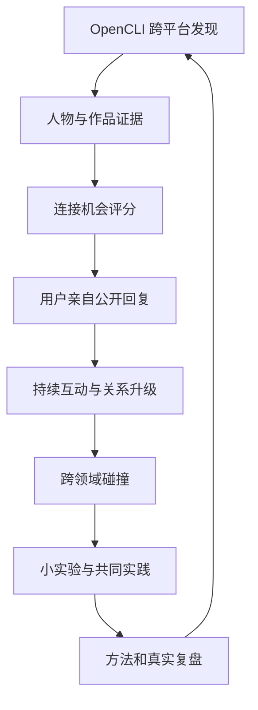
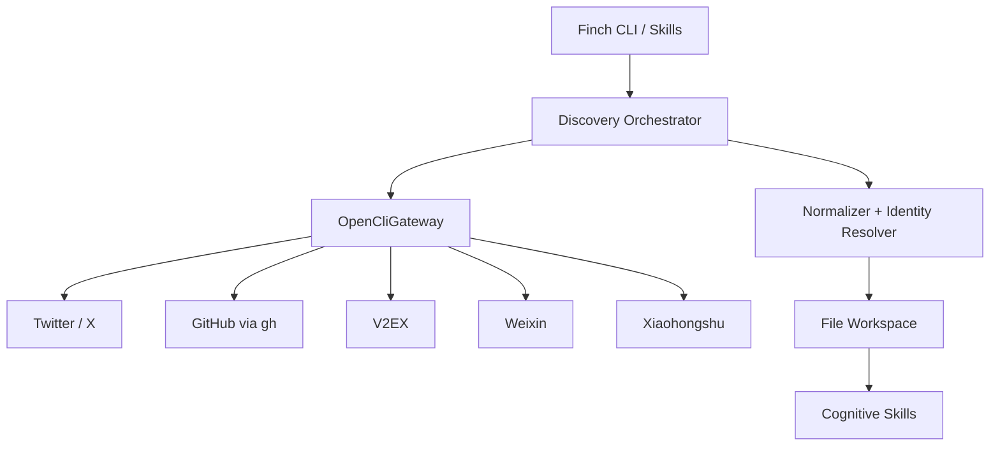

# Finch 跨平台创作者网络：OpenCLI 实现计划

> 版本：v1.0  
> 日期：2026-09-16  
> 状态：Proposed  
> 范围：Twitter/X、GitHub、V2EX、微信公众号、小红书

## 1. 项目结论

Finch 从“Agent Builder 内容助手”调整为：

> **以人为核心的跨平台探索与共创系统：发现持续创造、分享一手经验、能够连接不同领域的人，帮助用户从公开交流逐步走向共同实践，并把碰撞沉淀成小实验、方法和真实复盘。**

系统的北极星指标不是内容数量或粉丝增长，而是：

> **半年内形成 10–20 位有持续交流、能够交换经验或共同实践的跨行业同行。**

核心闭环：



## 2. 已确认的产品决策

| 决策项 | 结论 |
|---|---|
| 成功标准 | 形成 10–20 位持续交流的跨行业同行 |
| 优先发现对象 | 持续创造作品、分享一手经验、连接多个领域的人 |
| 行业范围 | 完全开放，不预设行业边界 |
| 核心实体 | 人；帖子、仓库、文章和笔记只是判断证据 |
| 首次连接方式 | 公开回复，并补充自己的真实经验 |
| 噪声过滤 | 持续创造、一手证据、分享意愿 |
| 平台范围 | Twitter/X、GitHub、V2EX、公众号、小红书同时接入 |
| 关系路径 | 发现 → 回复 → 再次互动 → 共同实践 |
| 目标产出 | 小实验、跨领域方法、真实经验与失败复盘 |
| 自动化边界 | Finch 自动发现、评分和起草；用户决定并亲自互动 |

## 3. 第一性原理与边界

### 3.1 Finch 要解决的问题

网络上并不缺内容，缺的是：

1. 从不同平台持续发现真正有创造行为的人；
2. 判断“为什么这个人值得现在连接”；
3. 找到自己能贡献的具体经验，而不是空泛夸赞；
4. 记住交流上下文，让一次回复自然发展为持续关系；
5. 把不同领域的结构相似性转化为可验证的小实验。

### 3.2 不做什么

- 不做全网内容聚合器；
- 不以热榜、点赞或粉丝数作为主要排序依据；
- 不自动回复、关注、私信或发布；
- 不把人物关系维护成销售 CRM；
- 不让 LLM 直接操作浏览器或决定远端写操作；
- 不把平台解析逻辑散落进 Finch 领域代码；
- 不为了“五个平台同时接入”而一次性深挖全部平台能力。

### 3.3 OpenCLI 在系统中的职责

OpenCLI 只承担统一的跨平台访问层：

- 复用本机 Chrome 登录状态；
- 使用站点 Adapter 输出结构化 JSON；
- 通过 `opencli gh` 接入 GitHub CLI；
- 内置 Adapter 不足时使用 `opencli browser` 做受控探索；
- 稳定的探索流程沉淀为 Finch 私有 OpenCLI Plugin/Adapter；
- 通过标准退出码暴露空结果、浏览器断开、超时、未登录和配置错误。

Finch 负责：调度、标准化、人物身份、证据、评分、关系状态、认知 Skill 和 Workspace。

## 4. 总体架构



### 4.1 分层职责

| 层 | 职责 | 是否允许 LLM |
|---|---|---:|
| OpenCliGateway | 执行命令、超时、退出码、JSON 解析、日志脱敏 | 否 |
| Source Adapter | 平台查询计划、参数、分页和字段映射 | 否 |
| Normalize/Identity | 统一数据模型、去重、身份候选关联 | 默认否 |
| Workspace | 原子写、幂等、索引、运行记录 | 否 |
| Discovery/Scoring | 候选召回、确定性基础分、每日配额 | 部分 |
| Cognitive Skills | 证据判断、连接机会、碰撞和草稿 | 是 |
| Interaction | 用户确认、复制草稿、手动发布、结果登记 | 用户拥有 |

### 4.2 关键约束

1. **OpenCLI 命令必须由程序以参数数组执行，禁止拼接 shell 字符串。**
2. **默认仅允许 `read` 类命令。** `post`、`reply`、`follow`、`like`、`publish` 等一律不进入允许列表。
3. Adapter 的命令和字段可能变化，启动时必须进行能力探测，不能把 README 中的命令表当成永久协议。
4. 原始结果先落盘，再做标准化；解析失败时保留证据，不丢数据。
5. 浏览器类任务按平台串行执行，避免共享登录态与 Tab 竞争；纯本地 `gh` 查询可以受控并发。

## 5. OpenCLI 集成设计

### 5.1 环境自检

新增 `finch sources doctor`：

1. 执行 `opencli doctor`；
2. 执行 `opencli list -f json` 获取当前能力；
3. 检查 `twitter`、`xiaohongshu`、`v2ex`、`weixin/web` 和 `gh`；
4. 检查 Chrome Profile 是否明确；
5. 对每个平台运行一个最小只读 smoke query；
6. 输出 `READY / DEGRADED / AUTH_REQUIRED / UNAVAILABLE`；
7. 不在日志中写 Cookie、Token、完整浏览器响应或个人敏感信息。

建议配置：

```yaml
opencli:
  profile: work
  format: json
  command_timeout_seconds: 60
  browser_connect_timeout_seconds: 45
  max_parallel_local: 3
  max_parallel_browser: 1
  allow_write_commands: false
```

### 5.2 OpenCliGateway

建议接口：

```python
class OpenCliGateway(Protocol):
    def capabilities(self) -> OpenCliCapabilities: ...
    def run(self, request: OpenCliRequest) -> OpenCliResult: ...

@dataclass(frozen=True)
class OpenCliRequest:
    surface: str
    command: str
    args: tuple[str, ...]
    profile: str | None
    timeout_seconds: int
    access: Literal["read"] = "read"

@dataclass(frozen=True)
class OpenCliResult:
    rows: list[dict[str, Any]]
    exit_code: int
    duration_ms: int
    stderr_summary: str | None
    capability_snapshot_id: str
```

退出码映射：

| OpenCLI code | Finch 结果 | 处理策略 |
|---:|---|---|
| 0 | `SUCCESS` | 进入标准化 |
| 66 | `EMPTY` | 正常空结果，不重试 |
| 69 | `BRIDGE_DOWN` | 停止该平台并提示启动 Browser Bridge |
| 75 | `TIMEOUT` | 最多一次带退避的重试；仍失败则降级 |
| 77 | `AUTH_REQUIRED` | 停止该平台并提示用户登录 |
| 78 | `CONFIG_ERROR` | 立即失败，不自动重试 |
| 130 | `CANCELLED` | 保存 checkpoint 后退出 |

### 5.3 能力探测与查询计划

每个平台实现 `SourceCapability`，运行时从 OpenCLI 能力快照生成查询计划：

```python
class SourceConnector(Protocol):
    source: Source

    def probe(self, capabilities: OpenCliCapabilities) -> SourceStatus: ...
    def plan(self, context: DiscoveryContext) -> list[OpenCliRequest]: ...
    def normalize(self, result: OpenCliResult) -> list[RawArtifact]: ...
```

查询路径按以下优先级选择：

1. OpenCLI 内置只读 Adapter；
2. OpenCLI External CLI，例如 `gh`；
3. Finch 自有 OpenCLI Plugin/Adapter；
4. `opencli browser` 临时探索路径；
5. 用户粘贴链接导入。

浏览器探索路径只能用于验证和发现稳定读取方式。连续稳定运行后，应沉淀为私有 Adapter，避免长期依赖自由浏览器操作。

### 5.4 平台接入矩阵

| 平台 | OpenCLI 主路径 | MVP 获取内容 | 身份主键 | 兜底路径 |
|---|---|---|---|---|
| Twitter/X | `twitter search/timeline/tweets/profile/thread` | 搜索结果、用户时间线、线程、资料 | handle + platform id | browser / URL import |
| GitHub | `opencli gh ...` | 用户、Repo、commit、issue、PR、release | GitHub login/id | GitHub URL import |
| V2EX | 运行时探测 `v2ex` 命令 | 主题、回复、成员页、节点 | member name/id | browser → 私有 Adapter |
| 公众号 | `weixin download`、`web read` 或能力探测结果 | 已知文章链接、作者、正文 | biz/account id（可得时） | URL import / browser |
| 小红书 | `xiaohongshu search/feed/user/creator-*` | 搜索、笔记、作者资料、创作者作品 | user id | browser / 分享链接 |

说明：

- 命令名只作为当前能力参考，实际调用由 `opencli list -f json` 和站点帮助结果确认。
- 五个平台在 Phase 1 同时进入观察面，但接入深度可以不同。
- 公众号 MVP 先围绕“文章链接与作者网络”，不承诺全局站内搜索。
- GitHub 继续利用 `gh` 的稳定 API 能力，但通过 OpenCLI CLI Hub 统一发现和调用入口。

## 6. 统一数据模型

### 6.1 RawArtifact

所有平台先映射为不可变原始对象：

```yaml
artifact_id: twitter:post:123
source: twitter
source_type: post
source_id: "123"
canonical_url: https://x.com/example/status/123
author_identity:
  platform: twitter
  external_id: "456"
  handle: example
title: null
text: "..."
published_at: 2026-09-16T01:00:00Z
metrics:
  replies: 8
  likes: 42
retrieved_at: 2026-09-16T02:00:00Z
capture_method: adapter
raw_ref: raw/twitter/2026-09-16/run_x/item_123.json
schema_version: 1
```

### 6.2 Person 与 Identity

```yaml
person_id: person_abc
display_name: Example
bio: "..."
identities:
  - platform: twitter
    external_id: "456"
    handle: example
    confidence: confirmed
  - platform: github
    external_id: "789"
    handle: example-dev
    confidence: probable
relationship_stage: discovered
first_seen_at: 2026-09-16T02:00:00Z
last_evidence_at: 2026-09-16T02:00:00Z
```

身份合并规则：

- 主页明确互链：可自动标为 `confirmed`；
- 相同用户名 + 多项弱证据：只生成 `probable` 候选；
- 仅用户名相同：禁止自动合并；
- 不确定身份进入待确认列表；
- 合并和拆分操作必须可逆并保留审计记录。

### 6.3 EvidenceCard

```yaml
evidence_id: evidence_xyz
person_id: person_abc
artifact_id: github:repo:owner/project
kind: creation
claim: "持续构建并公开迭代一个可运行项目"
support:
  - "过去 60 天有 12 次有效提交"
  - "README 含使用方法和设计取舍"
first_hand: true
confidence: 0.86
```

证据类型：

- `creation`：作品、代码、产品、实验；
- `first_hand_experience`：亲历过程、失败和数据；
- `knowledge_sharing`：可复用的方法与解释；
- `cross_domain_bridge`：连接多个领域的结构；
- `conversation_behavior`：认真回应和开放讨论；
- `marketing_or_repost`：营销、搬运或低原创度反证。

### 6.4 Relationship、Collision、Experiment

关系状态：

```text
discovered → engaged → recurring → practicing → collaborating
                         ↘ dormant ↗
```

只有出现以下证据才能升级：

- `engaged`：用户确认已进行一次公开互动；
- `recurring`：至少两次有内容的双向交流；
- `practicing`：围绕共同问题启动了实验或验证；
- `collaborating`：共同产生了可见成果。

## 7. 发现、评分和配额

### 7.1 两阶段排序

第一阶段使用确定性基础分缩小候选集：

| 维度 | 权重 | 信号示例 |
|---|---:|---|
| 持续创造 | 25 | 近期作品、commit、项目更新、连续创作 |
| 一手证据 | 25 | 数据、决策过程、失败、结果、可验证链接 |
| 分享意愿 | 20 | 解释方法、认真回复、公开材料 |
| 跨领域连接 | 15 | 多领域实践或可迁移方法 |
| 可共同实践 | 10 | 存在一周内可验证的问题 |
| 当前连接机会 | 5 | 用户此刻有真实经验可以补充 |

第二阶段只对 Top N 使用认知 Skill：

- 判断证据是否真的支持评分；
- 判断用户能贡献什么；
- 识别表面相似和结构相似；
- 输出连接建议及不确定性。

粉丝数、点赞量和热度仅用于理解语境，不直接提高人物分数。

### 7.2 每日配额

每日只输出 3 个槽位：

1. `new_creator`：一个新发现的创作者；
2. `reply_opportunity`：一个今天值得公开回应的人；
3. `relationship_next`：一个已有关系且存在真实后续理由的人。

约束：

- 同一平台最多占 2 个槽位；
- 同一人物 7 天内默认不重复，除非出现新作品或回复；
- 至少一个候选来自近 14 天未出现的平台或领域；
- 无高质量候选时允许少于 3 个，禁止用低质量结果补齐。

## 8. Skill 设计

Skill 只负责认知任务；采集、状态、文件写入和幂等由 Finch 服务负责。

### 8.1 `creator-discovery`

输入：标准化人物、最近作品与基础分。  
输出：候选解释、主要证据、风险和缺失信息。  
禁止：自行调用写操作或直接修改关系状态。

### 8.2 `creator-evidence`

输入：一个人的有限证据集合。  
输出：证据卡、第一手程度、可信度、反证。  
要求：每项判断必须引用 `artifact_id`。

### 8.3 `connection-opportunity`

输出：

- 对方最近在解决什么；
- 用户有哪些真实经验可贡献；
- 为什么现在值得互动；
- 不互动的理由；
- 最小连接动作。

### 8.4 `reply-crafting`

草稿结构默认采用：

> 具体观察 → 自己的真实经验/证据 → 一个可继续讨论的问题

质量规则：

- 禁止纯赞美；
- 禁止假装使用过对方产品；
- 禁止模型补造用户经历；
- 没有可贡献内容时返回 `SKIP`；
- 只生成草稿，不调用 OpenCLI 的 `reply/post`。

### 8.5 `relationship-review`

根据互动记录判断：

- 是否存在自然的下一次交流理由；
- 是否应进入 `recurring/practicing`；
- 是否暂时转为 `dormant`；
- 哪些信息不应被当作关系进展。

### 8.6 `collision-lab`

输出 `CollisionCard`：

```yaml
their_domain: 设计工具
your_domain: Agent Engineering
surface_similarity: "都涉及用户操作"
structural_similarity: "都需要只在高不确定性时要求用户介入"
shared_question: "如何降低 HITL 的中断成本？"
transferable_mechanism: progressive_disclosure
falsifiable_hypothesis: "按风险动态显示确认信息可减少无效确认"
```

### 8.7 `micro-experiment`

每个实验必须具备：

- 一周内可完成；
- 明确假设；
- 最小行动；
- 观察证据；
- 停止条件；
- 最终能形成作品、方法或失败复盘。

### 8.8 复用现有表达 Skills

- `feynman-practice`：检查理解断层；
- `sticky-message`：压缩核心信息；
- VoiceProfile：保持个人表达风格；
- draft generation：把实验结果转为经验分享。

## 9. Workspace 设计

```text
workspace/
├── sources/
│   ├── capabilities/
│   ├── cursors/
│   └── runs/
├── raw/
│   ├── twitter/
│   ├── github/
│   ├── v2ex/
│   ├── weixin/
│   └── xiaohongshu/
├── artifacts/
├── people/
│   └── {person_id}/
│       ├── profile.yaml
│       ├── identities.yaml
│       ├── evidence.jsonl
│       ├── interactions.jsonl
│       └── opportunities.yaml
├── collisions/
├── experiments/
├── drafts/
└── reviews/
```

幂等键：

```text
{source}:{source_type}:{source_id}:{content_version_or_fingerprint}
```

写入规则：

- 临时文件写完并校验后原子 rename；
- JSONL 事件追加必须带 `event_id`；
- 每次采集保存 `run_id`、查询、能力快照和退出状态；
- 原始数据只追加，派生数据可以重新构建；
- 不保存 Cookie、Token 和完整浏览器 Profile。

## 10. CLI 与用户交互

建议新增命令：

```bash
uv run finch sources doctor
uv run finch sources sync --all
uv run finch sources sync --source twitter
uv run finch people shortlist --today
uv run finch connections today
uv run finch connections record --person PERSON_ID
uv run finch collisions weekly
uv run finch experiments start COLLISION_ID
uv run finch review weekly
```

`finch connections today` 输出：

```text
1. 新发现的人
   - 为什么值得关注
   - 三条可追溯证据
   - 跨领域连接点

2. 今天值得回复的人
   - 对方正在讨论的问题
   - 你能贡献的真实经验
   - 建议回复草稿
   - [复制草稿] [跳过] [稍后]

3. 值得继续交流的人
   - 上次互动摘要
   - 新出现的自然后续理由
   - 不联系也合理的原因
```

用户亲自到原平台发布后，再执行记录命令或粘贴互动链接。MVP 不验证是否真正发布，也不自动操作远端平台。

## 11. 实施阶段

## Phase 0：契约与基线

目标：先冻结边界和可测契约。

任务：

- 定义统一数据模型和 JSON Schema；
- 实现 `OpenCliGateway` 与退出码映射；
- 实现命令允许列表，默认只读；
- 实现能力快照与 `sources doctor`；
- 为五个平台保存一组匿名化 fixture；
- 建立采集耗时、空结果率、失败类型基线。

验收：

- 未安装、Bridge 断开、未登录、超时和空结果能被正确区分；
- 任意 write 命令在进入 OpenCLI 前被 Finch 拒绝；
- 相同 fixture 重放得到相同标准化结果。

## Phase 1：五平台最小观察面

目标：五个平台都至少拥有一条可运行的只读采集路径。

任务：

- Twitter：搜索、人物资料、用户内容与线程；
- GitHub：用户、Repo、commit、issue/PR、release；
- V2EX：主题、回复和成员页；
- 公众号：文章链接导入、正文和作者信息；
- 小红书：搜索、笔记、用户/创作者资料；
- 实现原始数据落盘、标准化、分页、cursor 和去重；
- 对不稳定浏览器流程记录失败，不静默返回成功。

验收：

- 每个平台能够采集至少 20 条有效测试记录，或明确返回可解释的受限状态；
- 重复运行不会生成重复 Artifact；
- 单个平台失败不会阻塞其他平台；
- 每项标准化记录可追溯到原始文件和来源 URL。

## Phase 2：People First

目标：从内容流转换为人物与证据流。

任务：

- 实现 `Person/Identity/EvidenceCard`；
- 实现确定性身份关联和待确认队列；
- 实现基础评分与反证；
- 实现跨平台人物页；
- 生成每日三槽位 shortlist；
- 加入平台多样性和重复抑制。

验收：

- 仅凭相同用户名不会自动合并；
- 每个推荐人物至少包含两项可追溯证据；
- 推荐解释不依赖粉丝数和热度；
- 人物推荐人工接受率在试运行两周后达到 40% 以上。

## Phase 3：连接闭环

目标：帮助用户完成高质量首次回复，并记住后续上下文。

任务：

- 实现 `connection-opportunity`；
- 实现 `reply-crafting`；
- 增加 `SKIP` 和“不值得现在互动”的输出；
- 实现互动链接/摘要手动登记；
- 实现关系状态与 `relationship-review`；
- 每日包含一个已有关系的自然后续机会。

验收：

- 草稿中的用户经验均能追溯到用户证据；
- 无贡献点时不会强行生成回复；
- Finch 不执行任何远端写操作；
- 互动记录可重新构建当前关系状态。

## Phase 4：跨领域碰撞与实验

目标：从“认识人”进一步走向“共同探索问题”。

任务：

- 实现 `collision-lab`；
- 区分表面类比与结构类比；
- 实现 `micro-experiment`；
- 建立假设、证据、停止条件和结果记录；
- 每周只深度处理一个最值得验证的碰撞。

验收：

- 每张 CollisionCard 至少有两个来源证据；
- 每个实验能在一周内完成；
- 实验包含可证伪假设和停止条件；
- 试运行四周至少完成两个实验或形成明确失败复盘。

## Phase 5：经验沉淀与反馈

目标：把关系和实验产生的真实经验转为对别人有用的内容。

任务：

- 接入现有 draft、VoiceProfile、Feynman 和 Sticky Message；
- 从实验记录生成方法、边界和失败复盘；
- 建立周/月 Review；
- 根据接受、跳过、回复和持续交流信号调整推荐；
- 保留人工修正，不做不可解释的自动个性化。

验收：

- 每篇经验内容至少引用一个实验或互动证据；
- 能区分“实验事实”“个人判断”和“开放问题”；
- 30 天持续交流人数可被可靠计算；
- 推荐调整能够解释使用了哪些反馈信号。

## 12. 测试策略

### 12.1 单元测试

- OpenCLI 退出码映射；
- JSON 解析与异常输出；
- 五个平台字段标准化；
- 时间、URL、作者和内容指纹归一化；
- 幂等写入与去重；
- 身份候选关联；
- 评分与每日配额；
- write command allowlist 拦截。

### 12.2 Contract Tests

- 保存每个平台的匿名化 OpenCLI JSON fixture；
- 每日或升级 OpenCLI 后运行 Schema Drift 检查；
- `opencli list -f json` 能力快照发生变化时给出明确 diff；
- 字段缺失采用降级映射，不允许静默产生错误人物。

### 12.3 Live Smoke Tests

只在本机已登录浏览器上手动运行：

- 每个平台一个只读命令；
- 一个正常结果、一个空结果；
- 一个失效登录场景；
- 一个超时/Bridge 断开场景；
- 确认没有远端状态变化。

### 12.4 Skill Evals

为认知 Skill 建立固定样本：

- 真正的一手经验 vs 二手转述；
- 持续创造者 vs 高频营销账号；
- 结构性跨领域碰撞 vs 表面类比；
- 有贡献的回复 vs 空泛赞美；
- 应该继续联系 vs 没有自然理由的机械提醒。

## 13. 可观测性与失败恢复

每次 Source Run 记录：

- `run_id`、source、query fingerprint；
- OpenCLI capability snapshot；
- 开始/结束时间、duration；
- exit code 和 Finch 分类；
- 原始条数、标准化条数、去重条数；
- cursor/checkpoint；
- 是否使用 browser fallback；
- 重试次数和最终状态。

恢复规则：

- 成功写入一页后更新 checkpoint；
- 超时只重试一次，避免触发平台风控；
- `AUTH_REQUIRED` 和 `CONFIG_ERROR` 不自动重试；
- Browser Bridge 中断时，其他非浏览器源继续执行；
- 失败运行可以从最后 checkpoint 恢复，不重复深度分析已完成数据。

## 14. 安全、隐私与平台风险

- 默认只读取公开内容和用户主动登录后可见的普通页面；
- 不绕过验证码、访问控制、付费墙或平台限制；
- 不把浏览器 Cookie、Token 和登录态复制进 Finch Workspace；
- 日志只保留脱敏参数和错误摘要；
- 对公开内容保存必要摘录、URL 和分析，不批量永久镜像完整内容；
- 人物档案只服务于用户自身连接判断，不做画像交易或批量营销；
- 所有回复、关注、私信和发布都由用户在原平台亲自完成；
- OpenCLI 升级必须先跑 Contract Tests，再进入日常任务。

## 15. 指标与 Review

### 北极星指标

`active_cross_domain_relationships_30d`

定义：最近 30 天内，双方至少发生两次有具体内容的互动，并围绕作品、问题或实践持续交流的人数。

### 漏斗指标

| 阶段 | 指标 |
|---|---|
| 发现 | 人物推荐接受率、证据充足率、平台分布 |
| 首次连接 | 推荐到回复转化率、回复获得回应率 |
| 持续关系 | 首次到第二次互动转化率、30 天持续交流人数 |
| 共同实践 | 进入 `practicing` 的人数、碰撞到实验转化率 |
| 经验沉淀 | 实验完成率、形成复盘/方法的比例 |

### 反指标

- 每日候选增加，但接受率下降；
- 回复数量上升，但第二次互动率下降；
- 推荐集中于大号或单一平台；
- 跨领域碰撞只有词汇相似，没有可迁移机制；
- 为了维持关系而生成没有新价值的回复。

## 16. 推荐代码结构

```text
src/finch/
├── sources/
│   ├── opencli_gateway.py
│   ├── capabilities.py
│   ├── models.py
│   ├── orchestrator.py
│   └── connectors/
│       ├── twitter.py
│       ├── github.py
│       ├── v2ex.py
│       ├── weixin.py
│       └── xiaohongshu.py
├── people/
│   ├── models.py
│   ├── identity.py
│   ├── evidence.py
│   ├── scoring.py
│   └── repository.py
├── connections/
│   ├── models.py
│   ├── service.py
│   └── repository.py
├── collisions/
├── experiments/
├── skills/
└── workspace/

tests/
├── fixtures/opencli/
├── contract/
├── sources/
├── people/
├── skills/evals/
└── integration/
```

如果当前 Finch 已有等价目录，优先在现有领域模块中演进，避免为了匹配此目录树进行无价值搬迁。

## 17. 推荐实施顺序

严格按以下顺序推进：

1. `OpenCliGateway + doctor + read-only guard`；
2. 五个平台最小 Connector 和 fixture；
3. `RawArtifact + Person + Identity + EvidenceCard`；
4. 去重、幂等、cursor 和能力快照；
5. 确定性评分和每日三槽位；
6. `creator-evidence + connection-opportunity`；
7. `reply-crafting + 用户手动互动记录`；
8. 关系阶段与 `relationship-review`；
9. `collision-lab + micro-experiment`；
10. VoiceProfile、Feynman、Sticky Message 与周/月反馈闭环。

不要先做：自动发布、复杂 UI、全量历史抓取、社交图谱可视化、向量数据库、通用工作流引擎或多 Agent 编排。

## 18. MVP 完成定义

满足以下条件才算完成 MVP：

- 五个平台各有一条真实可运行的只读路径；
- OpenCLI 异常不会被误判为成功或空结果；
- 每天能够给出至多三个以人为核心的推荐；
- 每个人物至少有两个可追溯证据；
- 能生成“我可以贡献什么”的连接机会，而非只摘要对方内容；
- 用户可获得回复草稿，但 Finch 不替用户发布；
- 能记录一次互动并在未来给出有新理由的后续建议；
- 每周能从跨领域证据生成一个可验证的小实验；
- 所有派生判断都能回到原始来源、Artifact 和运行记录；
- 连续运行两周后，可用人工接受率和第二次互动率评估效果。

## 19. 主要风险与应对

| 风险 | 影响 | 应对 |
|---|---|---|
| 平台 DOM/API 变化 | Adapter 返回空或字段变化 | 能力快照、fixture、Contract Test、私有 Adapter |
| 登录态或风控 | 数据源间歇性失败 | 浏览器自检、低并发、无静默重试、人工恢复 |
| 五平台范围过大 | 接入消耗超过产品验证 | 每平台只做一条最小读取路径，优先验证人物闭环 |
| 跨平台身份误合并 | 错误人物画像 | 强证据自动关联，弱证据必须人工确认 |
| LLM 把二手内容当经历 | 推荐质量下降 | EvidenceCard 引用、反证字段、Skill Eval |
| 推荐变成大号榜单 | 偏离连接目标 | 热度不计分、平台配额、持续创造和一手证据优先 |
| 机械维护关系 | 产生低价值互动 | 必须提供“为什么现在联系”和新的贡献点 |
| 浏览器写操作误触 | 远端状态变化 | Finch read-only allowlist，禁止调用 OpenCLI write 命令 |

## 20. 参考资料

- [OpenCLI 官方仓库与命令说明](https://github.com/jackwener/opencli)
- [OpenCLI Getting Started](https://github.com/jackwener/opencli/blob/main/docs/guide/getting-started.md)
- [OpenCLI Adapter 开发说明](https://github.com/jackwener/opencli/blob/main/docs/developer/ts-adapter.md)
- [OpenCLI Weixin Adapter 文档](https://github.com/jackwener/opencli/blob/main/docs/adapters/browser/weixin.md)
- [OpenCLI 官网](https://opencli.info/)

这些能力以 2026-09-16 的官方资料为基线。实现时以本机 `opencli list -f json`、具体站点帮助和 Contract Test 结果为准。
