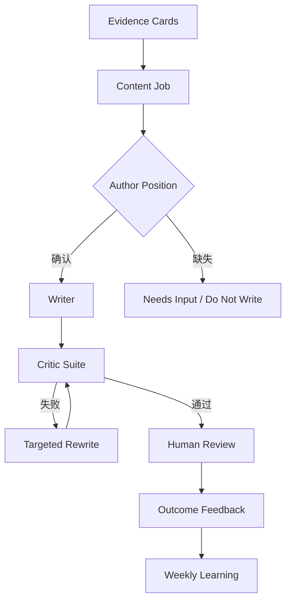

# Finch：让 AI 完成它的工作——实现计划

> 基于 `flingjie/Finch` 最新 HEAD `e99a2b6`（2026-09-02）生成。当前基线：195 tests passed，Ruff 与 mypy 通过。

## 1. 结论

Finch 已经具备 Evidence First、确定性 Graph Runtime、Writer/Critic、人工审核和周复盘，不应重构为新的多 Agent 平台。本轮目标是补齐三段缺失链路：

1. 写作前：把“有证据”升级为“有明确 Content Job 和作者判断”。
2. 写作后：把单一 Critic 总分升级为可解释、可定向修复的检查器组合。
3. 发布后：把互动数据升级为“内容是否完成预定工作”的效果反馈。

目标链路：



## 2. 当前代码与目标能力的映射

| 当前能力 | 代码位置 | 保留/调整 |
|---|---|---|
| Evidence Card | `evidence/models.py`, `evidence/extractor.py` | 保留，作为事实基础 |
| Discussion Match | `evidence/matcher.py`, `graph/match_nodes.py` | 保留，增加 Content Job 候选输入 |
| Draft | `content/models.py`, `content/writer.py` | 增加 `content_job_id` 与 position 约束 |
| 单一 Critic | `content/critic.py` | 拆为 checker suite，保留总分作汇总 |
| 节点内重写循环 | `graph/content_nodes.py` | 保留有界循环，改为针对失败项重写 |
| approve/revise/skip | `review/service.py` | 扩展观点确认、拒绝分类和有效性评分 |
| Feedback | `review/models.py`, `review/feedback.py` | 增加定性 outcome 与任务完成度 |
| Weekly report | `review/weekly.py` | 增加有效性、泛化率、人工纠正率等指标 |

## 3. 领域模型设计

### 3.1 Content Job Contract

新增 `src/finch/content/jobs.py`：

```python
class IntendedEffect(BaseModel):
    understand: str
    believe: str | None = None
    action: str | None = None

class AuthorPosition(BaseModel):
    claim: str
    decision: str
    tradeoff: str
    change_mind_if: str | None = None
    confirmed: bool = False

class SuccessCriterion(BaseModel):
    id: str
    description: str
    measurement: Literal["critic", "human", "outcome"]

class ContentJobStatus(StrEnum):
    PROPOSED = "proposed"
    NEEDS_INPUT = "needs_input"
    READY = "ready"
    DO_NOT_WRITE = "do_not_write"

class ContentJob(BaseModel):
    id: str
    source_card_ids: list[str]
    candidate_id: str | None = None
    reader_problem: str
    audience: str
    intended_effect: IntendedEffect
    author_position: AuthorPosition | None = None
    success_criteria: list[SuccessCriterion]
    recommended_format: DraftKind
    status: ContentJobStatus
    missing_questions: list[str] = Field(default_factory=list, max_length=3)
```

硬规则：

- `source_card_ids` 必须是 `MatchResult.card_ids` 的子集；原创内容必须来自本次可发布 Evidence Cards。
- 缺少 `author_position.decision` 或 `tradeoff` 时进入 `NEEDS_INPUT`，最多提出 3 个问题。
- 证据不足、没有增量或没有适合读者的任务时输出 `DO_NOT_WRITE`；这是正常成功结果。
- 未确认 position 的内容可以生成“提纲建议”，不能进入正式 Draft/Review。

### 3.2 Draft 与 Review 扩展

修改 `content/models.py`：

- `Draft.content_job_id: str`
- `Draft.position_statement: str`
- `Draft.critic_report_id: str | None`

修改 `review/models.py`：

- `ReviewAction` 增加 `CONFIRM_POSITION`（独立于最终发布批准）。
- `SkipReason` 增加 `NO_CLEAR_POSITION`、`GENERIC_VOICE`、`JOB_NOT_USEFUL`、`FACT_ERROR`。
- `ReviewDecision` 增加 `position_correct: bool | None`、`voice_match: int | None`、`job_clear: bool | None`。

避免破坏现有审核历史：新增字段全部提供默认值；数据库仍使用 payload JSON，随后补 Alembic 基线迁移。

## 4. Graph 增量设计

在 `MatchEvidenceNode` 与 `DraftNode` 之间增加两个节点：

| 节点 | reads | writes | 状态 |
|---|---|---|---|
| `DefineContentJobsNode` | `match_results`, `evidence_cards`, `candidates` | `content_jobs` | `JOBS_DEFINED` |
| `PositionGateNode` | `content_jobs` | `ready_jobs` | `POSITIONS_READY` / `NEEDS_INPUT` |

调整后内容段：

```text
MatchEvidenceNode
→ DefineContentJobsNode
→ PositionGateNode
→ DraftNode
→ CritiqueNode
→ BriefNode
```

Runtime 不增加 LLM 路由或回边。`PositionGateNode` 使用确定性校验；需要用户补充时保存状态并停止。补充命令更新 Content Job 后，利用现有 replay/resume 机制从 gate 继续。

`DraftNode` 改为读取 `ready_jobs + evidence_cards + candidates`，不再直接从 match 自动写稿。空 job、`DO_NOT_WRITE` 均返回成功空列表。

## 5. Critic Suite

### 5.1 检查器接口

新增 `src/finch/content/checkers/`：

```python
class CheckResult(BaseModel):
    checker: str
    passed: bool
    severity: Literal["low", "medium", "high", "hard_fail"]
    locations: list[str]
    issues: list[str]
    rewrite_instructions: list[str]
    requires_human_input: bool = False
```

第一批检查器：

| Checker | 实现方式 | 目的 |
|---|---|---|
| `EvidenceChecker` | 现有 claims 校验 + LLM 蕴含 | 无证据/越界主张 hard fail |
| `SpecificityChecker` | LLM + 抽象词规则 | 找出删除修辞后无信息的句子 |
| `PortabilityChecker` | LLM 反事实测试 | 检测可套用于任何项目的内容 |
| `DecisionChecker` | Content Job 对齐 | 确认文章表达了已确认的选择与取舍 |
| `VoiceChecker` | voice profile + LLM | 检测 Alexa 声和非作者措辞 |
| `StructureChecker` | 确定性统计 + LLM | 检测过多标题、机械三段式和标点滥用 |
| `ActionabilityChecker` | Content Job 对齐 | 判断 intended effect 是否落实 |
| `SafetyChecker` | 复用现有 safety/critic | 保持隐私、虚构经历和指标门禁 |

### 5.2 汇总与重写

保留 `CritiqueResult` 作为兼容性汇总模型，但增加 `checks: list[CheckResult]`。`passed` 由确定性聚合器计算，不能直接相信模型返回：

- 任一 `hard_fail`：拒绝。
- 任一 high 且 `requires_human_input=true`：进入 `NEEDS_INPUT`。
- 其余失败项：进入定向重写。
- 重写 prompt 只接收失败检查器的具体指令，禁止无目标“整体润色”。
- 每轮保存 checker report 与 draft version，便于重放和分析。

## 6. Voice Profile

新增 `src/finch/content/voice.py` 与 `voice-profile.yaml`：

- `preferred_patterns`
- `avoid_phrases`
- `rhythm_rules`
- `approved_example_ids`
- `rejected_example_ids + reasons`

不要直接把所有历史推文当正例。只有人工批准且 `voice_match` 达标的内容才能进入 approved examples；人工修改文本优先于原始 AI 草稿。

增加 CLI：

```bash
finch voice show
finch voice approve-example <draft-id>
finch voice reject-example <draft-id> --reason ...
```

## 7. HITL 与 CLI

新增命令：

```bash
finch jobs list --status needs_input
finch jobs show <job-id>
finch jobs answer <job-id> --file answers.yaml
finch jobs confirm-position <job-id>
finch jobs reject <job-id> --reason ...
finch run resume <run-id>
```

Daily Brief 每个候选展示：

1. 这篇内容要完成的工作。
2. 目标读者及期望动作。
3. 证据来源。
4. Finch 提议的核心判断与取舍。
5. Critic 未解决风险。
6. 推荐动作：确认观点、补充背景、暂不写。

审核继续保留“用户在 Finch 外手动发布”的安全边界。

## 8. 效果反馈与度量

扩展 `Feedback`：

```python
class OutcomeAssessment(BaseModel):
    job_completed: Literal["yes", "partly", "no", "unknown"]
    reader_understood: bool | None = None
    desired_action_count: int | None = None
    useful_reply_count: int | None = None
    github_clicks: int | None = None
    notes: str | None = None
```

周报增加：

- `evidence_coverage`：关键 claim 中通过证据检查的比例。
- `decision_density`：含明确 decision/tradeoff 的已发布内容比例。
- `generic_sentence_rate`：PortabilityChecker 标记句子比例。
- `human_correction_rate`：人工修改事实或立场的草稿比例。
- `job_completion_rate`：被标记为 yes/partly 的比例。
- `useful_reply_rate`：有技术案例、反例或高质量问题的回复比例。
- `do_not_write_rate`：被正确挡下的弱选题比例，不将其视为失败。

互动数只作为信号，不直接训练“更像爆款”。优先优化 Content Job 完成度和高质量讨论。

## 9. 持久化与迁移

新增记录：

- `ContentJobRecord`
- `CriticReportRecord`
- `DraftVersionRecord`
- `OutcomeAssessment` 放入现有 `FeedbackRecord.payload_json`

虽然 `Store.init()` 当前可直接建表，本轮应正式接入已有 Alembic 依赖：

1. 创建当前 schema baseline。
2. 添加 content jobs / critic reports / draft versions migration。
3. 对现有 Draft 兼容：无 `content_job_id` 的历史草稿只读展示，不参与新指标。
4. repository 方法避免 N+1，沿用最新 commit 的批量读取原则。

## 10. 分阶段实施

### Phase A：Content Job 最小闭环（优先级 P0）

1. 新增 Content Job 模型、prompt、repository。
2. 新增 `DefineContentJobsNode` 与 `PositionGateNode`。
3. 修改 Draft 模型与 `DraftNode` 输入。
4. 新增 jobs CLI 与 resume 流程。
5. 更新 Daily Brief 展示 job、position、questions。

验收：给定一组 Evidence Cards，系统能稳定产生 `READY / NEEDS_INPUT / DO_NOT_WRITE`；未确认立场不得进入正式草稿。

### Phase B：可解释 Critic Suite（P0）

1. 抽取统一 checker protocol。
2. 先迁移 Evidence、Decision、Specificity、Portability 四个 checker。
3. 实现确定性聚合与 targeted rewrite。
4. 保存每轮 draft version 与 checker report。
5. 再加入 Voice、Structure、Actionability、Safety。

验收：每次拒绝或重写都能指出具体句子、失败原因和修改指令；hard fail 不被总分覆盖。

### Phase C：HITL 与 Voice Learning（P1）

1. 扩展 review 模型与 CLI。
2. 增加 position confirmation。
3. 建立 voice profile 与正反样本管理。
4. 将人工 diff 分类为事实、观点、语气、结构四类。

验收：Finch 能区分“事实错”“观点不是我的”“不像我说话”“任务本身无价值”。

### Phase D：Outcome Feedback（P1）

1. 扩展 feedback 命令和数据模型。
2. 实现新 weekly metrics。
3. 将 Content Job 成功标准与 outcome 对齐。
4. 输出每周“继续/调整/停止”的建议，不自动修改生产阈值。

验收：周报可以回答哪些内容任务有效、哪些失败，以及失败发生在选题、证据、观点、表达还是分发。

### Phase E：Evals 与试运行（P0，贯穿各阶段）

在 `tests/evals/` 建立固定数据集，至少覆盖：

- 强证据 + 清晰判断 → READY。
- 强证据 + 无作者判断 → NEEDS_INPUT。
- 弱证据/无增量 → DO_NOT_WRITE。
- 通用 AI 套话 → Portability/Specificity fail。
- 有数字但无证据 → hard fail。
- 有明确取舍且风格自然 → pass。
- 重写两轮仍失败 → 不进审核。

每个 Phase 合并门槛：`pytest`、`ruff`、`mypy` 全绿；新增 prompt 必须有 contract test；Graph recovery/replay 测试不得回退。

## 11. 建议 PR 切分

| PR | 内容 | 风险 |
|---|---|---|
| 1 | Content Job 模型、仓储、prompt、单测 | 低 |
| 2 | 两个 Graph 节点、状态与 replay | 中 |
| 3 | jobs CLI、HITL、Daily Brief | 中 |
| 4 | Checker protocol + Evidence/Decision | 中 |
| 5 | Specificity/Portability + targeted rewrite | 高（prompt eval） |
| 6 | Voice/Structure/Actionability/Safety | 中 |
| 7 | Draft versions、critic reports、Alembic | 中 |
| 8 | Outcome feedback 与 weekly metrics | 低 |
| 9 | eval corpus、两周 trial 文档与阈值校准 | 中 |

每个 PR 保持可运行、可回滚，不把 Runtime 改造成循环图，也不引入自动发布。

## 12. Definition of Done

- 每个正式 Draft 都绑定一个 `READY` 且 position 已确认的 Content Job。
- 每个 Content Job 绑定可追溯 Evidence Cards，并明确受众、预期效果与成功标准。
- Finch 能把弱题判为 `DO_NOT_WRITE`，把缺作者判断的题判为 `NEEDS_INPUT`。
- Critic 的每个失败都有位置、原因、严重级别和定向修改指令。
- 安全与证据 hard fail 不能被质量均分覆盖。
- 所有人工修改和观点确认可追溯；发布仍需人工批准并在外部完成。
- 周报能衡量任务完成度、人工纠正、内容泛化与有效讨论，而不只统计互动数。
- 全量测试、Ruff、mypy 通过；恢复、重放、幂等与只读权限边界保持不变。

## 13. 第一实施批次

先完成 PR 1–3。它们会改变 Finch 的生产逻辑：从“找到证据就写”升级为“先定义内容要完成的工作并确认作者判断，再写”。完成后再拆 Critic，避免在错误的输入契约上优化文风。
