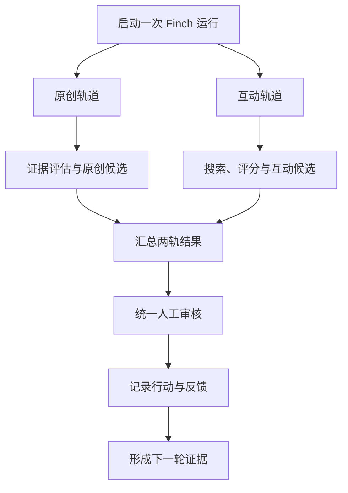

# Finch：原创生产与外部互动双轨执行计划（Python）

## 1. 目标

Finch 的每次运行同时启动两条相互独立、可并行执行的轨道：

- **原创轨道**：收集个人工作证据，识别认知增量，并在达到成熟度阈值时生成原创内容。
- **互动轨道**：搜索与用户兴趣相关、值得交流的帖子，筛选高价值候选，生成有实质内容的互动草稿，并将互动及反馈沉淀为后续证据。

是否存在可发布证据，只影响原创轨道本轮是否产生原创草稿，不再决定互动轨道是否执行。单条轨道没有产出时，不阻塞另一条轨道。

本次改动不得改变 Finch 的核心闭环：

> 收集证据 → 识别认知增量 → 判断成熟度 → 行动 → 记录反馈 → 形成新证据

## 2. 范围边界

### 本次实现

- 增加每轮必执行的 `discover_engagement` 轨道。
- 由统一 orchestrator 同时调度原创轨道与互动轨道，并在末端汇总结果。
- 使用现有兴趣配置搜索外部帖子。
- 对帖子进行相关性、观点增量、可交流性、实践证据和关系价值评分。
- 生成收藏、观察作者或回复草稿等互动建议。
- 公开回复、引用和私信默认进入人工确认队列。
- 保存搜索、评分、互动和反馈记录。
- 将经验证的讨论结果升级为个人证据。

### 本次不实现

- 不重构现有证据采集和原创内容生成逻辑，只调整顶层调度方式。
- 不把外部帖子直接标记为个人证据。
- 不自动发布观点型回复、引用转发或私信。
- 不以互动数量、点赞量或日更作为优化目标。
- 不引入新的前端；优先复用现有 CLI、配置和存储层。

## 3. 目标流程



核心调度规则：

```python
original_result, engagement_result = await asyncio.gather(
    run_existing_original_content_flow(context),
    run_discovery_engagement_flow(context),
    return_exceptions=True,
)

return merge_run_results(
    original_result=original_result,
    engagement_result=engagement_result,
)
```

`run_existing_original_content_flow` 内部继续使用原有证据阈值：没有成熟证据时返回空原创结果。互动轨道不读取该结果作为启动条件。`asyncio.gather(..., return_exceptions=True)` 表达的是故障隔离要求；如果当前 runtime 不适合真正并发，可顺序执行，但两条轨道仍必须在每轮运行中独立执行。汇总函数必须显式识别异常对象，不能把异常当作正常结果。

## 4. 数据与类型设计

建议新增以下领域类型；实际文件位置应遵循当前项目结构，不为本功能另建平行架构。

```python
from datetime import datetime
from enum import StrEnum
from typing import Literal

from pydantic import BaseModel, Field


EvidenceOrigin = Literal["personal", "external", "conversation"]
Platform = Literal["x", "reddit"]


class ExternalPost(BaseModel):
    id: str
    platform: Platform
    url: str
    author_id: str
    author_name: str
    content: str
    published_at: datetime
    metrics: dict[str, int | float] = Field(default_factory=dict)
    matched_topics: list[str] = Field(default_factory=list)


class ConversationScore(BaseModel):
    relevance: float = Field(ge=0, le=1)
    novelty: float = Field(ge=0, le=1)
    discussability: float = Field(ge=0, le=1)
    practical_evidence: float = Field(ge=0, le=1)
    relationship_value: float = Field(ge=0, le=1)
    total: float = Field(ge=0, le=1)
    reasons: list[str]


class InteractionAction(StrEnum):
    IGNORE = "ignore"
    BOOKMARK = "bookmark"
    OBSERVE_AUTHOR = "observe_author"
    DRAFT_REPLY = "draft_reply"
    DRAFT_QUOTE = "draft_quote"
    DRAFT_DM = "draft_dm"


class InteractionStatus(StrEnum):
    PROPOSED = "proposed"
    APPROVED = "approved"
    REJECTED = "rejected"
    EXECUTED = "executed"
    EXPIRED = "expired"


class InteractionCandidate(BaseModel):
    post: ExternalPost
    score: ConversationScore
    action: InteractionAction
    draft: str | None = None
    approval_required: bool
    status: InteractionStatus = InteractionStatus.PROPOSED
```

建议使用 Pydantic 承担外部输入验证和持久化边界模型；纯内部、无验证需求的小对象可以使用 `dataclasses.dataclass`，避免所有对象都依赖 Pydantic。

### Python 技术基线

- Python 3.12+。
- `asyncio`：双轨并发调度和超时控制。
- Pydantic 2：外部帖子、模型评分结果和审批记录验证。
- `httpx.AsyncClient`：异步 HTTP 适配器；OpenCLI 仍优先通过现有封装调用。
- `tenacity`：只用于明确可安全重试的只读搜索；发布动作不得自动重试为成功。
- `pytest`、`pytest-asyncio`：单元、集成和并发行为测试。
- `ruff`、`mypy`：格式、静态检查和类型边界。

证据升级规则：

- `external`：搜索到的帖子，只能作为外部信号。
- `conversation`：用户确认并产生实际交流后形成的讨论记录。
- `personal`：用户形成自己的判断，并有案例、代码、实验或多来源验证后才能升级。

## 5. 配置设计

在现有配置体系中增加以下字段：

```yaml
engagement:
  enabled: true
  schedule: every_run
  platforms: [x, reddit]
  max_posts_scanned: 30
  min_candidate_score: 0.72
  max_bookmarks: 5
  max_reply_drafts: 3
  max_public_replies: 2
  per_author_daily_limit: 1
  public_expression_requires_approval: true

interests:
  stable:
    - agent reliability
    - agent evals
    - graph engineering
    - agent harness
  exploring:
    - durable execution
    - failure replay
    - dynamic graph
    - production agent failures
  excluded:
    - AI 新闻搬运
    - 融资与估值
    - 无实践依据的模型排名
```

默认评分权重：

| 维度 | 权重 |
|---|---:|
| 主题相关性 | 0.25 |
| 观点增量 | 0.25 |
| 可交流性 | 0.20 |
| 实践证据 | 0.20 |
| 关系价值 | 0.10 |

## 6. 分阶段实施

### Phase 0：建立基线和契约

任务：

1. 定位现有证据采集、内容路由、发布审核、配置、日志和存储模块。
2. 为当前原创流程补充回归测试，固定有证据和无成熟证据时的行为。
3. 定义双轨运行契约：每轮均调用两条轨道，各自返回结构化结果。
4. 记录当前有证据和无证据运行结果，作为改造前基线。

验收：

- 原创内容流程拥有可重复的回归测试。
- 互动轨道不依赖原创轨道的证据判断结果。
- 禁用 `engagement.enabled` 时，只运行原有原创轨道。

### Phase 1：增加双轨调度与领域模型

任务：

1. 在现有 orchestrator/graph 中增加原创与互动双轨 fan-out，以及结果汇总 fan-in。
2. 新增外部帖子、评分结果、互动候选和审批状态类型。
3. 为每次运行生成 `runId`，串联证据判断、搜索、评分和互动记录。
4. 两条轨道使用同一个 `runId`，但拥有独立状态、错误和产出集合。
5. 使用 `asyncio.gather(..., return_exceptions=True)` 隔离故障：一条轨道失败不抹掉另一条轨道的有效结果。

验收：

- 有无成熟证据时都执行两条轨道。
- 原创轨道没有成熟证据时返回成功空结果，互动轨道继续运行。
- 互动轨道没有候选时返回成功空结果，原创轨道结果不受影响。
- 任一轨道失败时，汇总结果明确标记部分失败，不把整轮误报为完全成功。

### Phase 2：实现帖子搜索适配器

任务：

1. 使用 `typing.Protocol` 定义统一异步接口 `PostSearchProvider.search(query, cursor=None)`。
2. 首先接入当前 Finch 已有或计划使用的 X/OpenCLI 搜索能力。
3. Reddit 作为第二适配器；若尚无稳定访问方式，保留接口并返回明确的未启用状态。
4. 用稳定主题与探索主题生成查询；排除词必须在搜索后再进行一次本地过滤。
5. 标准化 URL、作者、正文、时间和指标字段。
6. 以 `platform + postId` 去重，并跳过近期已处理帖子。

验收：

- 单个平台失败不会让整轮运行被误判为成功互动。
- 搜索返回结果可追溯到原始 URL 和查询词。
- 不重复推荐最近已经处理的帖子。

### Phase 3：实现价值评分

任务：

1. 先用确定性规则过滤：排除主题、内容过短、纯转发、重复内容和已互动帖子。
2. 再由模型对五个维度分别评分，并要求给出可审计理由。
3. 在代码中确定性计算加权总分，模型不得直接决定最终总分。
4. 仅保留 `total >= min_candidate_score` 的帖子。
5. 最终排序优先考虑实践证据和可交流性；热度只作辅助特征。

验收：

- 相同结构化评分输入得到相同总分。
- 每个候选都有逐项分数和简短理由。
- 泛泛热点帖低于包含真实案例、代码或失败记录的帖子。

### Phase 4：生成互动策略与草稿

任务：

1. 根据帖子的内容和分数选择 `bookmark`、`observe_author` 或草稿类动作。
2. 回复草稿必须至少完成一项工作：补充案例、提出推进问题、指出假设、提供反例、连接概念或提出验证方法。
3. 禁止生成无信息量的称赞、复述原帖或假装拥有不存在的实践经历。
4. 草稿附带 `intent`、所依据的帖子片段摘要和事实风险标记。
5. 每轮最多产生 3 条回复候选。

验收：

- 每条回复都能说明它为讨论新增了什么。
- 没有足够个人证据时，只能提问或明确标注为推测，不能虚构案例。
- 草稿长度、语气和语言与原帖及用户配置匹配。

### Phase 5：审批与执行保护

任务：

1. `draft_reply`、`draft_quote`、`draft_dm` 强制进入人工确认状态。
2. 审批界面至少展示原帖、作者、评分理由、建议动作和完整草稿。
3. 执行前再次检查目标帖子是否仍存在、草稿是否被修改、是否超过作者/每日限额。
4. 对超时、限流和不确定返回不得静默重试并标记成功。
5. 保存用户修改前后版本，用于后续学习，但不自动改变发布权限。

验收：

- 未批准的公开表达无法被发送。
- 远端返回不确定时状态为 `unknown` 或 `failed`，绝不标记为成功。
- 同一互动动作具备幂等键，避免重复发送。

### Phase 6：反馈回流与证据升级

任务：

1. 保存互动结果及后续回复、点赞等反馈快照。
2. 从讨论中提取问题、分歧、待验证假设和可能的实验。
3. 将其保存为 `conversation` 类型候选证据。
4. 只有通过个人实践或外部验证后，才允许提升为 `personal`。
5. 后续原创内容必须引用自己的新增判断，不能简单改写原帖。

验收：

- 可以从一次互动追溯到原帖、草稿、审批、实际发布和后续证据。
- 外部帖子不会未经验证进入原创内容证据集合。

### Phase 7：可观测性与评估

记录以下指标：

- `no_evidence_runs`
- `posts_scanned`
- `candidates_above_threshold`
- `drafts_generated`
- `draft_approval_rate`
- `user_edit_distance`
- `interactions_executed`
- `meaningful_response_rate`
- `conversation_to_personal_evidence_rate`
- `duplicate_or_low_value_rate`
- 单轮延迟与模型成本

质量评估不以互动数量为核心。首要指标是：

1. 用户愿意批准或只需少量修改的草稿比例。
2. 互动是否获得实质回复。
3. 互动是否产生后续实验、判断或原创内容证据。

## 7. 测试计划

### 单元测试

- 每轮同时调度原创轨道和互动轨道。
- 两条轨道的空结果、成功和失败状态彼此独立。
- 双轨结果汇总不会丢失任一轨道的有效产出。
- 五维评分和加权计算。
- 排除主题、重复帖子、作者限额和每日限额。
- 外部信号到个人证据的升级约束。
- 所有公开表达动作的审批要求。

### 集成测试

- 搜索提供方正常、空结果、限流、超时和结构异常。
- 多平台部分失败。
- 草稿生成、审批、修改、拒绝和过期。
- 执行返回成功、失败和不确定状态。

### 端到端场景

1. 有 commit 且达到阈值：生成原创候选，同时生成互动候选。
2. 无 commit 但有 Notion/设计证据：原创轨道照常评估，同时执行互动轨道。
3. 无可发布证据且找到高价值帖子：原创轨道返回空，互动轨道生成候选。
4. 有原创候选但没有合格帖子：保留原创结果，互动轨道返回空。
5. 两条轨道都没有候选：成功结束，不凑内容。
6. 一条轨道失败：保留另一条轨道结果，并标记本轮部分失败。
7. 用户拒绝任一草稿：不发布，记录拒绝原因，不影响其他候选。
8. 发布调用超时：不重试为成功，保留人工处理状态。
9. 讨论形成新假设：先保存为 conversation，经验证后再升级。

## 8. 建议提交顺序

每个提交应保持可测试、可回滚：

1. `test: lock existing evidence-to-content behavior`
2. `feat: orchestrate original and engagement tracks every run`
3. `feat: add external post search provider`
4. `feat: score conversation value deterministically`
5. `feat: generate bounded engagement proposals`
6. `feat: require approval for public interactions`
7. `feat: capture feedback as conversation evidence`
8. `chore: add engagement metrics and e2e fixtures`

## 9. 完成定义

满足以下条件才算完成：

- 原有原创内容路径的回归测试全部通过。
- 每次运行均调用原创轨道和互动轨道，不以证据状态决定是否搜索帖子。
- 互动轨道能搜索、筛选并返回最多 3 个高价值互动候选。
- 任一轨道为空或失败时，另一条轨道的有效结果仍被保留。
- 找不到合格帖子时不会强制输出。
- 所有公开观点表达均经过人工确认。
- 搜索结果、评分理由、审批和执行结果全链路可追溯。
- 外部信号不会直接成为个人证据。
- 关闭互动轨道配置后恢复为仅运行原有原创轨道。
- 端到端测试覆盖正常、空结果、部分失败、拒绝和超时场景。

## 10. Codex 执行提示

执行时先检查仓库现状并把上述逻辑映射到真实模块，不要机械创建计划中假设的目录。每完成一个 Phase：

1. 运行该阶段最小相关测试。
2. 运行原主流程回归测试。
3. 汇报变更文件、行为差异和未解决风险。
4. 未经明确授权，不执行真实公开回复或私信。

建议首先完成 Phase 0—3，交付一个只读双轨 MVP：每轮同时输出原创评估结果和带评分理由的互动候选；验证调度隔离与候选质量后，再接入草稿审批与真实互动。
