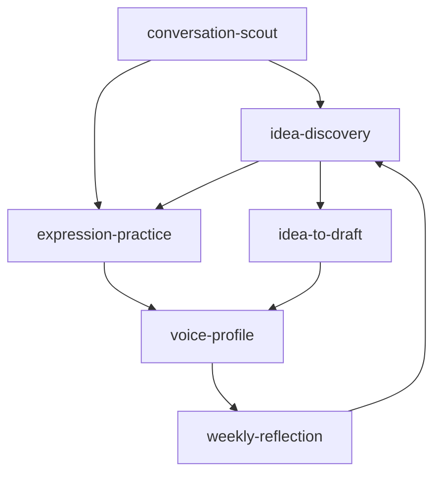

# Finch Skill 重构设计

日期：2026-09-08
状态：已确认（用户逐段批准）

## 1. 第一性原理结论

Finch 的 Skill 不应按数据来源或技术模块拆分，而应按用户能独立感知的「认知任务」拆分。

判断一个能力是否应成为 Skill，只问三个问题：

1. 是否需要模型进行开放性判断？
2. 用户是否可能单独调用它？
3. 是否有清晰且独立的输入输出？

采集、状态机、存储、幂等、评分、Critic 门禁都不是 Skill，继续由 Python 领域服务负责。

最终保留 **8 个 Skill**：6 个 Finch 核心 Skill，2 个通用辅助 Skill。

## 2. 决策记录

| # | 决策点 | 结论 |
|---|--------|------|
| D1 | 代码边界 | **skills + 完整 Python 服务**：skill 之外为 expression-practice / conversation-scout / weekly-reflection 新增领域服务 + CLI，并同步改 IdeaCandidate 契约与 IdeaService/SearchService。 |
| D2 | weekly-reflection 与确定性 `finch weekly` 的关系 | **替换**：`finch weekly` 输出从确定性指标表变成 LLM 定性复盘。但 7 个指标的计算函数**保留**，作为复盘的输入之一（否则丢失硬指标，且违反「分数/指标由代码算」不变量）。 |
| D3 | conversation-scout 产物如何落地 | **持久化为新模型** `Opportunity`（新表 + opportunity_json），CLI 列出/查看，用户显式转交 idea-discovery。 |
| D4 | expression-practice 交互与持久化 | **skill 对话驱动 + 一次性 CLI**：新增 `PracticeSession` 表；交互由 Claude Code skill 驱动（像 feynman 一句句追问），每步调一次性 CLI 落库（`finch practice start/diagnose/save/finish`）。 |

确认项（设计者拍板，用户已认可）：

- C1：`weekly-reflection` 替换但保留指标计算函数。
- C2：`_shared/idea-contract.md` **保留**（IdeaCandidate 契约仍被多个 skill 引用）。

## 3. 核心流程



两条主路径：

```text
提升自己：idea-discovery → expression-practice → voice-profile → weekly-reflection
快速产出：idea-discovery → idea-to-draft → review
```

## 4. Skill 层（8 skill + `_shared` 重组）

| 当前 | 目标 | 类型 |
|---|---|---|
| `commit-to-idea` | → `idea-discovery`（commit / fragment / conversation 三来源 reference） | 合并 |
| `search-to-idea` | → `conversation-scout`（输出从 IdeaCandidate 改为 Opportunity） | 改造 |
| `idea-to-draft` | 保留，SKILL.md 降为 Assist 模式（DraftService 不动） | 重述 |
| — | `expression-practice`（新增，主入口） | 新增 |
| — | `voice-profile`（包装现有 `finch voice` + `VoiceProfile`） | 新增 |
| — | `weekly-reflection`（定性 LLM，替换确定性 `finch weekly`） | 新增 |
| `feynman-practice` | 保留 | 不变 |
| `sticky-message` | 保留 | 不变 |

### 4.1 `idea-discovery`

把个人证据、零散思考或真实交流提炼成一个值得继续发展的 Idea。支持三种来源模式：Commit/PR/测试等个人工程实践；用户输入的一句话/片段/模糊判断；已验证的 ConversationEvidence。来源不同只需不同 reference，不需要三个 Skill。

合并并替代：`commit-to-idea`、计划中的 `fragment-to-idea`、计划中的 `conversation-to-idea`。

输出（IdeaCandidate 扩展契约，见 §5.1）：

```yaml
core_point: 一个中心想法
observation: 实际观察到了什么        # 新增
reader_problem: 同行正在面对什么
why_worth_saying: 为什么值得现在说
intent: stance | exploration        # 新增，默认 stance
open_question: ""                    # 新增，可选
author_position:
  claim:
  decision:
  tradeoff:
source_refs: []                      # 保留（可追溯 + 幂等 key）
boundaries: {known: [], inferred: [], unknown: []}
recommended_format: original|reply|thread
generator: {skill, version}
```

边界：外部帖子不能直接变成个人观点；没有完整结论可输出 `exploration`；不生成草稿；不负责搜索交流对象（那是 conversation-scout）。

目录：

```text
idea-discovery/
  SKILL.md
  references/
    commit-signals.md
    fragment-signals.md
    conversation-signals.md
```

### 4.2 `conversation-scout`

从公开讨论中寻找值得交流的人、问题和切入口。输出「交流机会」，由用户决定是否转成自己的 Idea（不再像 `search-to-idea` 那样直接构造通用作者立场并落为 IdeaCandidate）。

输出（`Opportunity`，见 §5.3）：

```yaml
source_post:
shared_tension:
why_relevant:
response_angles: [share_experience, ask_mechanism, challenge_assumption]
knowledge_gap:
relationship_value:
```

边界：不替用户形成观点；不把别人的经历写成用户经历；不直接生成完整回复；不因帖子热门就推荐；优先寻找真实问题、分歧、失败案例和未解决机制。

目录：

```text
conversation-scout/
  SKILL.md
  references/
    opportunity-signals.md
    audience-profile.md
```

### 4.3 `expression-practice`（核心，新增）

让用户通过实际表达提升能力。

流程：选择 Idea → 用户先表达 → 诊断最大问题 → 提一个问题 → 用户重新表达 → 对比前后版本 → 保存最终版本。

检查维度：是否真正理解；是否有自己的判断；是否说明因果关系；是否与目标同行有关；是否具体；是否像用户自己；是否留下值得回应的空间。

强制规则：不先给完整范文；一次只追问一个关键问题；默认不自动 rewrite；保存用户原文和每次修改；用户明确要求代写时转到 `idea-to-draft`。

输出（`PracticeSession`，见 §5.4）：

```yaml
initial_attempt:
diagnosis:
questions_asked: []
revisions: []
final_expression:
lesson:
```

目录：

```text
expression-practice/
  SKILL.md
  references/
    diagnosis-rules.md
    session-output.md
```

### 4.4 `idea-to-draft`（降为 Assist 模式）

保留 DraftService，SKILL.md 降为 Assist 模式。适用于：用户没时间练习；已想清楚只需快速成稿；批量生成待审核版本；用户明确说「直接帮我写」。

流程：Confirmed Idea → VoiceProfile-aware Writer → Critic → 有限定向 rewrite → 人工审核。

边界：不冒充表达训练；不改变已确认立场；不从外部信号补造个人经历；不自动发布；不把 AI 生成文本直接加入 VoiceProfile。

目录：

```text
idea-to-draft/
  SKILL.md
  references/
    draft-patterns.md
```

### 4.5 `voice-profile`（新增 skill，领域代码已存在）

初始化和更新个人表达画像。输入：用户历史发布内容、expression-practice 最终版本、人工修改后的采用版本、明确拒绝的表达及理由。输出：`preferred_patterns` / `avoid_phrases` / `rhythm_rules` / `approved_examples` / `rejected_examples` + 可追溯 diff。

领域代码已存在（`src/finch/content/voice.py` 的 `VoiceProfile` + `finch voice` CLI），本次只加 skill 包装，无代码改动。

边界：不生成内容；不根据点赞量自动改风格；不从单个样本推导全局规则；不从未经确认的 AI 草稿学习；更新前展示 diff，用户确认后写入。

目录：

```text
voice-profile/
  SKILL.md
  references/
    extraction-rules.md
    sample-format.md
```

### 4.6 `weekly-reflection`（新增，替换确定性周报）

把一周的表达、修改、讨论和结果转成下一周的一个训练重点。输入：首稿与最终稿、Critic 报告、人工修改记录、VoiceProfile 变化、有意义的回复、ConversationEvidence、发布后效果数据（含 §6 保留的 7 个确定性指标）。

只回答四个问题：本周真正想清楚了什么；哪次表达最像自己；哪次交流产生了新连接或新问题；下周只训练哪一个表达问题。

输出：

```yaml
insight:
strongest_expression:
meaningful_connection:
next_practice:
stop_doing:
voice_update_candidate:
new_idea_candidates: []
```

边界：不自动更新 VoiceProfile；不输出十几条泛泛建议；不以发帖数/点赞量为主要目标；每周只选择一个表达实验。

目录：

```text
weekly-reflection/
  SKILL.md
  references/
    reflection-contract.md
```

### 4.7 `feynman-practice` 与 `sticky-message`

保持现状，职责不变。`feynman-practice` 检查用户是否真的理解；`sticky-message` 检查已形成的想法是否清晰、具体、易记。两者都不生成对外内容、不落库、不改风格。

### 4.8 `_shared` 重组

- **保留**：`evidence-policy.md`、`author-position.md`、`idea-contract.md`。
- **新增**：`expression-contract.md`（有限 rewrite、默认不自动 rewrite、保存用户原文）、`publication-safety.md`（不自动发布、gh/opencli 只读、write 拒绝名单）。
- **吸收**：`quality-policy.md` 拆进 `publication-safety.md`（不自动发布）+ `expression-contract.md`（有限 rewrite）；「分数由代码算」已入 CLAUDE.md 不变量，不进 skill md。`voice-guide.md` 的「作者口吻」内容并入 `voice-profile/references/`。

```text
_shared/
  evidence-policy.md
  author-position.md
  idea-contract.md
  expression-contract.md
  publication-safety.md
```

## 5. 数据与契约变更

### 5.1 `IdeaCandidate` 扩展（向后兼容）

保留承重字段（`source_refs` / `why_worth_saying` / `recommended_format` / `generator` / `boundaries`），新增三个字段：

- `observation: str` — 实际观察到了什么。
- `intent: Literal["stance", "exploration"] = "stance"` — 立场型 / 探索型。
- `open_question: str = ""` — 可选，未解决的开放问题。

`generator.skill` 在 idea-discovery 合并后统一为 `"idea-discovery"`。

### 5.2 `ContentJob` 扩展

新增三个可选字段（payload_json 持久化，无需迁移表结构）：`observation`、`intent`、`open_question`。

`origin` 的 `Literal["commit", "search", "user"]` 扩为 `Literal["commit", "search", "user", "conversation"]`（供 ConversationEvidence 来源）。

### 5.3 新模型 `Opportunity`（conversation-scout 产物）

新表 `opportunity`（SQLModel record）+ `opportunity_json` 列。字段即 conversation-scout 输出 schema：`source_post` / `shared_tension` / `why_relevant` / `response_angles` / `knowledge_gap` / `relationship_value`。

`Opportunity` 不是 ContentJob、不是证据，是独立中转记录。用户选中后可显式交给 idea-discovery（`finch ideas` 的 conversation 来源或手工输入）。

### 5.4 新模型 `PracticeSession`（expression-practice）

新表 `practice_session`（SQLModel record）+ payload_json。字段：`initial_attempt` / `diagnosis` / `questions_asked: list[str]` / `revisions: list[str]` / `final_expression` / `lesson`，关联 `idea_id`（可选 `opportunity_id`）。

## 6. Python 服务 + CLI 变更

| 变更 | 现状 | 目标 |
|---|---|---|
| `SearchService.to_ideas` 产出 IdeaCandidate | 改造为 `OpportunityService`，产出 `Opportunity`，不再落 ContentJob | `finch scout`（search / list / show） |
| — | 新增 `PracticeService` + `PracticeSessionRepository` | `finch practice`（start / diagnose / save / finish，每步一次性 CLI） |
| `learn/weekly.py` 确定性 narrative | 新增 `WeeklyReflectionService`（LLM 定性复盘）；7 个指标计算函数保留作为输入 | `finch weekly` 重新指向 |
| `IdeaService.create_candidate` | 携带 `observation`/`intent`/`open_question`；新增 conversation / user / opportunity 来源入口 | `finch ideas`（保留 commit；新增 create） |
| `voice-profile` | 已有 `VoiceProfile` + `finch voice`，无改动 | 仅加 skill 包装 |

### 6.1 idea-discovery 的来源入口

现有 `finch ideas` 只有 `commit` / `search` / `list` / `show` / `confirm` / `revise-position` / `skip`，没有「用户片段」和「ConversationEvidence」的入口。本次新增 `finch ideas create` 承载 idea-discovery 的三种非 commit 来源：

- `finch ideas create --text "..."` → origin=`user`（用户输入的一句话/片段）。
- `finch ideas create --conversation <evidence-id>` → origin=`conversation`（已验证 ConversationEvidence）。
- `finch ideas create --opportunity <id>` → 把 conversation-scout 的 Opportunity 转成 idea，origin=`search`，仍须遵守「外部帖 ≠ 个人证据」的中性化规则。

`finch ideas search` 退役，其「搜索 → IdeaCandidate」路径由 `finch scout`（产出 Opportunity）+ `finch ideas create --opportunity`（转 idea）两步取代。

### 6.2 weekly-reflection 的指标保留

`src/finch/learn/weekly.py` 中 `evidence_coverage` / `decision_density` / `generic_sentence_rate` / `human_correction_rate` / `job_completion_rate` / `useful_reply_rate` / `do_not_write_rate` 七个计算函数保留，改为向 `WeeklyReflectionService` 提供输入（而非直接渲染「继续/调整/停止」文案）。`_build_narrative` 的确定性文案被 LLM 定性复盘替换。

### 6.3 不变量（保持不变）

- 证据优先：`Commit → EngineeringEvent → EvidenceCard → Draft`，无 Evidence Card 不生成内容。
- 外部帖 ≠ 个人证据：只有验证过的 `ConversationEvidence` 经 `promote_to_personal` 提升。
- 不自动发布：`gh`/`opencli` 只读，write 命令在拒绝名单。
- 分数/指标由代码算：LLM 输出不携带 total；weekly 指标仍由代码算。
- 子进程纪律：args 数组、每调用超时、JSON 经 Pydantic 校验。
- 领域服务确定性、单线程；并行仅限服务步骤内的 I/O 绑定 `pool.map`。

## 7. 迁移顺序（增量，每步测试绿）

1. `_shared` 重组 + `idea-to-draft` 降 Assist（纯 md，无代码）。
2. `IdeaCandidate`/`ContentJob` 扩展 `observation`/`intent`/`open_question` + conversation 来源（后端兼容，老 commit/search 流程不受影响）。
3. `idea-discovery` 合并 commit-to-idea（skill md + reference，`finch ideas commit` 不变；新增 `finch ideas create` 承载 user / conversation / opportunity 来源，见 §6.1）。
4. `conversation-scout`：`Opportunity` 模型 + `OpportunityService` + `finch scout`，退役 `search-to-idea` 的 IdeaCandidate 路径。
5. `voice-profile` skill 包装（无代码）。
6. `expression-practice`：`PracticeSession` + `PracticeService` + `finch practice` + skill。
7. `weekly-reflection`：`WeeklyReflectionService` + 替换 `finch weekly`（保留指标计算函数作为输入）。

## 8. 测试与 evals

- 现有 evals 迁移：`commit-to-idea/evals` → `idea-discovery/evals`；`search-to-idea/evals` → `conversation-scout/evals`（case 输出断言从 IdeaCandidate 改为 Opportunity）；`idea-to-draft/evals` 保留。
- 新增 evals：`expression-practice`（诊断只追问一个问题、不先给范文的样例）、`voice-profile`（diff 展示 + 单样本不推导全局规则）。
- 单元测试：`IdeaCandidate`/`ContentJob` 新字段序列化；`OpportunityService` 提炼 + 落库；`PracticeService` 各步骤状态转换；`WeeklyReflectionService` 输入组装 + LLM 输出 Pydantic 校验。
- 契约测试：conversation-scout 不产出 IdeaCandidate、不落 ContentJob；weekly 指标仍由代码算。

## 9. 范围外（Non-goals）

- 不新增 `humanizer` / `anti-ai-style` / `fact-checker` / `self-critique` / `ban-ai-words` / `draft-reviewer` / `finch-orchestrator` / `daily-content`（与现有 Critic 重复或只是确定性流程包装）。
- 不改变 GitHub / X / Reddit 适配器（仍只读）。
- 不改变状态机、幂等 key、评分聚合、Critic 硬门禁的领域归属。
- 不实现 `weekly-reflection` 自动更新 VoiceProfile（仍须人工确认）。
