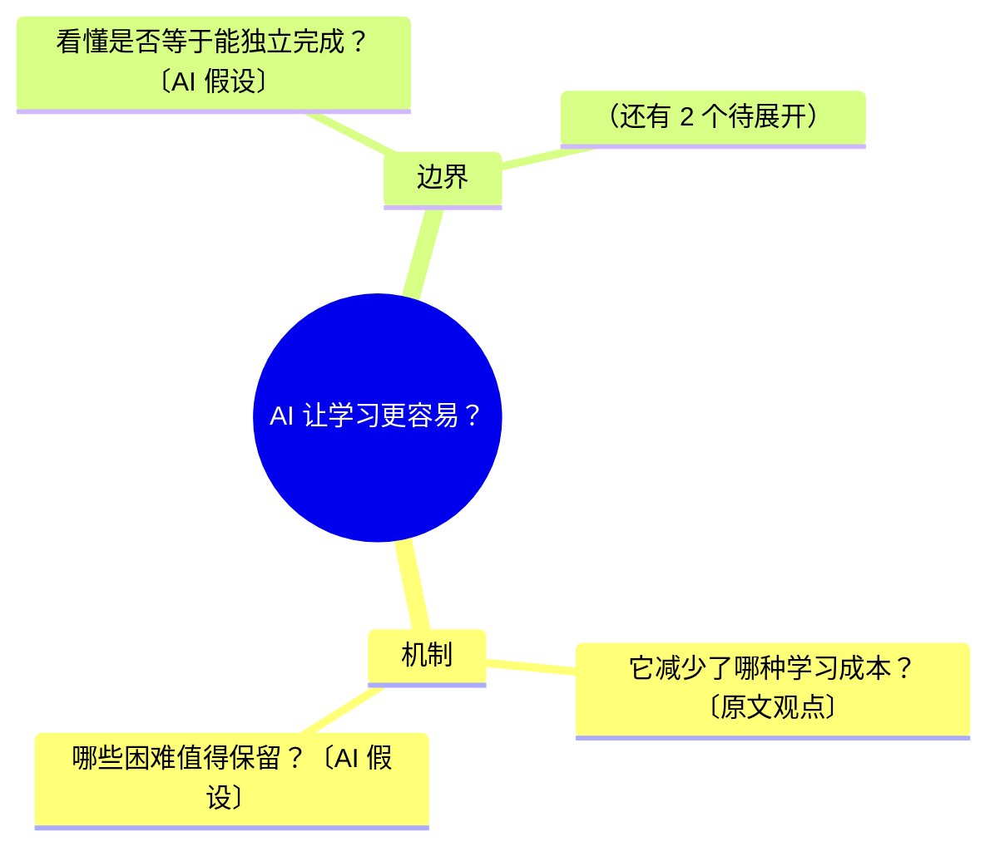
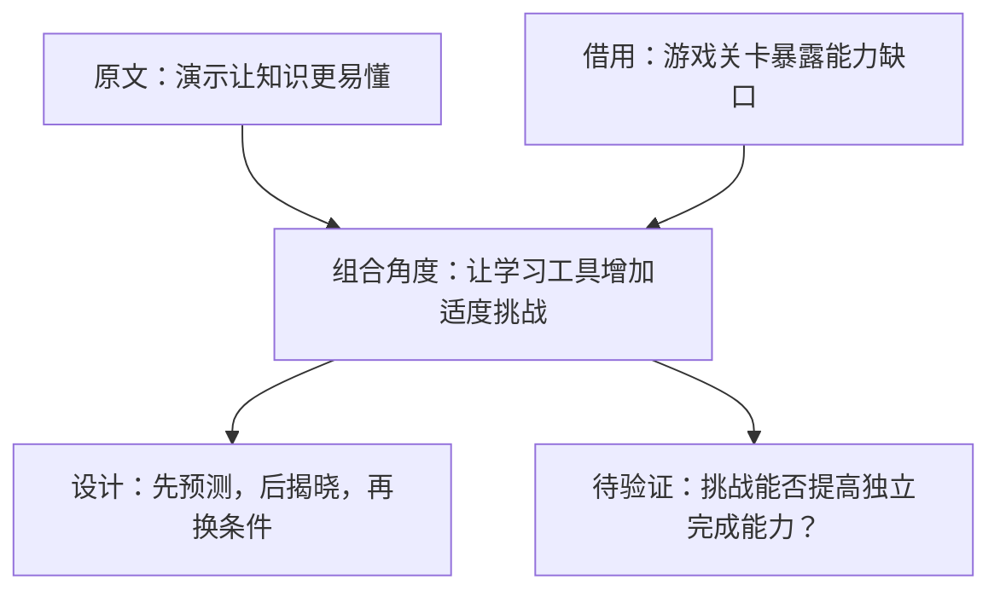

# 文章选角 · 可继续探索的思维导图（`finch angles map`）设计

日期：2026-10-08
状态：已确认（用户逐段批准）

## 1. 背景与目标

现有 `finch angles discover`（`article-angle-discovery`）是**一次性收敛**：一次结构化 LLM 调用读完全文，一次返回完整 `AngleBrief`（原文摘要 → 1–3 张选题卡 → 推荐方向），跑完即存库，没有逐轮状态。它的产出是「已经筛选过的收敛结果」。

用户需要的是一种**发散**面：一篇文章到底还能往哪里追问、哪些想法能组合、自己缺什么材料。这需要一张**可继续探索的思维导图**——生成后能点节点展开、能连两个节点组成新角度、能按选中的角度再生成因果图或实验流程图。价值不在图有多少节点，而在「借助这张图，提出一个初始输出里没有的角度，并能用自己的话说清为什么值得探索」。

本设计新增一条与 `discover` 平行的发散面 `finch angles map`，不改造现有 `discover`。

## 2. 与现有 discover 的关系（核心决策）

`discover` = 收敛找选题；`map` = 发散探索。两者是两条并行的面，各自独立：

- `discover` 原样不动，其模型、prompt、状态、测试都不改。
- `map` 从**原始 source** 独立发起一次新的发散调用，**不依赖** `discover` 先跑，也**不从**已存 brief 派生种子。原因：发散不该被收敛结果污染；`discover` 的 `gaps` 是「作者已列的缺口」，当种子会让发散面变窄。
- `map` 走到「组合角度」即止，**不自动 handoff**：不自动生成 `AngleCard`、不写 `angle_briefs`、不创建 `ContentJob`。与现有「本 Skill 不做自动 handoff」约定一致。用户想写，手动拿这个角度去 `discover` 或 `drafts`。

## 3. 决策记录

| # | 决策点 | 结论 |
|---|--------|------|
| D1 | 放哪 | **新增子命令 `finch angles map`**，不改造 `discover`，不开新 skill。 |
| D2 | 交互载体 | **终端 Mermaid + 落库 YAML 状态对象**：图不是一次性文本，是 workspace 里可增长的 YAML；终端用 Mermaid 渲染。将来上交互页从同一份 YAML 渲染。 |
| D3 | 图内容来源 | **`map` 独立发散调用**，从 source 起步；v1 不支持 `--brief` 复用。 |
| D4 | 组合角度是否接下游 | **完全自包含**，不自动导出/建草稿；将来需要再加 `--to-brief`。 |

确认项（设计者拍板，用户已认可）：

- C1：v1 五个命令，把「改条件 / 找反例」折进 `expand --move` 而非各开命令，控制命令数。
- C2：`new` 对同源文章（同 content_hash）重复跑默认拒绝，提示已存在，`--force` 重生成，避免误覆盖已展开的图。
- C3：六个思考动作里，v1 只落 `继续追问`（expand）、`组合`（connect）、内联 `改条件/找反例`（`expand --move`）；`联系我的经历`、`暂存问题` 留 v2。
- C4：节点 id 用图内稳定的 n0/n1…，供 expand/connect 引用；不依赖随机 id。

## 4. 数据模型

新增 `MindMap` 状态对象，落库 workspace（目录 `mind_maps/`），YAML，原子写（`Workspace.atomic_write`），确定性 id `map_{content_hash[:16]}`。

结构是「根问题 → 思考维度（机制/边界/个人经历/跨域组合/小验证）→ 问题叶子」。**叶子是问题，不是分类目录**；跨分支连接走 Edge，组合走 Combination。

### 4.1 `MindMapNode`

| 字段 | 类型 | 说明 |
|---|---|---|
| `id` | str | n0/n1…，图内稳定，创建顺序分配 |
| `label` | str | 节点文本：问题（或维度名） |
| `source` | Literal | `原文观点` / `我的补充` / `AI 假设` / `待验证` 四选一，标注节点来源 |
| `parent_id` | str \| None | 成树；根为 None |
| `expanded` | bool | 是否已展开；false 时渲染折叠成「（N 个待展开）」 |

### 4.2 `MindMapEdge`

跨分支连线（普通导图只长分支，跨分支连接更值得做）。

| 字段 | 类型 | 说明 |
|---|---|---|
| `from_id` | str | 起节点 |
| `to_id` | str | 终节点 |
| `relation` | Literal | `支持` / `冲突` / `类比` / `推测` 四选一，标明连线性质 |

### 4.3 `MindMapCombination`

「连两个节点」的产物，附四个简短说明 + 候选角度。

| 字段 | 类型 | 说明 |
|---|---|---|
| `node_a` / `node_b` | str | 被连接的两个节点 |
| `connection_rationale` | str | 连接理由：两个想法在哪个机制上相通 |
| `incremental_value` | str | 新增价值：比原文多解释了什么 |
| `applicable_boundary` | str | 适用边界：什么情况下不能迁移 |
| `validation_gap` | str | 验证缺口：还需要什么案例或实验 |
| `angle_title` | str | 候选角度标题（一句话问题或主张） |
| `thesis` | str | 中心主张 |

### 4.4 `MindMap`

| 字段 | 类型 | 说明 |
|---|---|---|
| `id` | str | `map_{content_hash[:16]}`，代码填 |
| `source_type` / `source_ref` / `content_hash` | — | 确定性，代码填，与 `AngleBrief` 同源 |
| `root_label` | str | 根问题（如「AI 让学习更容易？」） |
| `nodes` | list[MindMapNode] | 全节点 |
| `edges` | list[MindMapEdge] | 跨分支连线 |
| `combinations` | list[MindMapCombination] | 组合角度，append-only |

## 5. CLI 面（v1 五个命令）

### 5.1 `map new`

```
finch angles map new --text/--file/--url [--reader …] [--reader-problem …]
  [--author-context …] [--practice-ref …] [--goal …]
```

一次发散调用生成根 + 4–6 个展开分支，存库，打印 map id + Mermaid。同源文章（同 content_hash）重复跑 → 拒绝并提示已存在 id；`--force` 重生成（覆盖）。

### 5.2 `map show`

```
finch angles map show <map-id> [--depth N] [--json]
```

渲染当前图。树用 `mindmap`，折叠节点合并成「（N 个待展开）」标记；组合另以 `flowchart` 打印。

### 5.3 `map expand`

```
finch angles map expand <map-id> <node-id> [--move 追问|改条件|反例] [--predict "…"]
```

沿节点展开下一层，保留你的补充、预测，局部更新导图。`--move` 内联「继续追问 / 改条件 / 找反例」三种思考动作；`--predict` 是「先写一句预测再展开」——先把你的预测落成 `我的补充` 节点，再让 AI 沿它展开。

### 5.4 `map connect`

```
finch angles map connect <map-id> <node-a> <node-b>
```

生成组合角度（四个说明 + 候选角度），存 `Combination`，打印 flowchart。

### 5.5 `map list`

列出已存导图 id。

## 6. 发散调用 + 证据边界

`new` / `expand` / `connect` 各走一次**独立**的 LLM 调用（`prompts/map-mindmap.md` 等，与 `discover-angles.md` 分离），复用：

- `references/angle-library.md` 的「核心追问」生成问题节点；
- `references/combination-patterns.md` 的「桥问题」生成组合（连接理由）。

证据规则与 `discover` 完全一致（沿用 `_shared/evidence-policy.md`）：

- 原文是外部证据，其主张/例子/结果永远不得写成作者亲历。
- `--practice-ref` 是材料不是证明；无真实记录时建议实验或标 `待验证` / 假设场景。
- 组合要过「拿掉第二份材料，结论是否基本不变」的试金石；不过即淘汰。
- 不把热度当真相；不虚构亲历；不强行唱反调；不得把类比当证据。
- **不自动 handoff、不建 ContentJob、不写 angle_briefs。**

节点来源标注（`原文观点`/`我的补充`/`AI 假设`/`待验证`）与连线关系（`支持`/`冲突`/`类比`/`推测`）用于诚实标注，避免漂亮的图让假设显得已经成立。

## 7. 渲染示例（对齐用户演示）





## 8. 测试与验收

单测（`tests/unit/`）：

- 确定性 id、字段覆盖（service 覆盖 content_hash/source_type/source_ref，不信任模型输出）。
- prompt 注入：发散调用含角度库核心追问 + 组合桥问题 + 证据边界。
- `expand` 不丢失用户补充（`我的补充` 节点保留）。
- `new` 同源重复跑拒绝、`--force` 覆盖。
- repository 原子写 + 幂等 upsert。

验收点（`evals/cases.yaml` 增补）：**能否借这张图，提出一个初始输出里没有的角度，并用自己的话讲清为什么值得探索**——比图有多少节点更接近「发散思维」。

## 9. 边界（v1 不做）

- 不改造 `discover`；不自动 handoff。
- 不做交互式 HTML 页面（留到验证「这张图真能帮提出新角度」之后）。
- 不做 `--to-brief` 导出、`--brief` 复用、`联系我的经历` / `暂存问题` 动作（均留 v2）。
- 因果图 / 实验流程图：v1 只到「组合角度」即止；按选中角度生成因果图/实验流程图属后续阶段（用户已明确「再按选中的角度生成」）。
